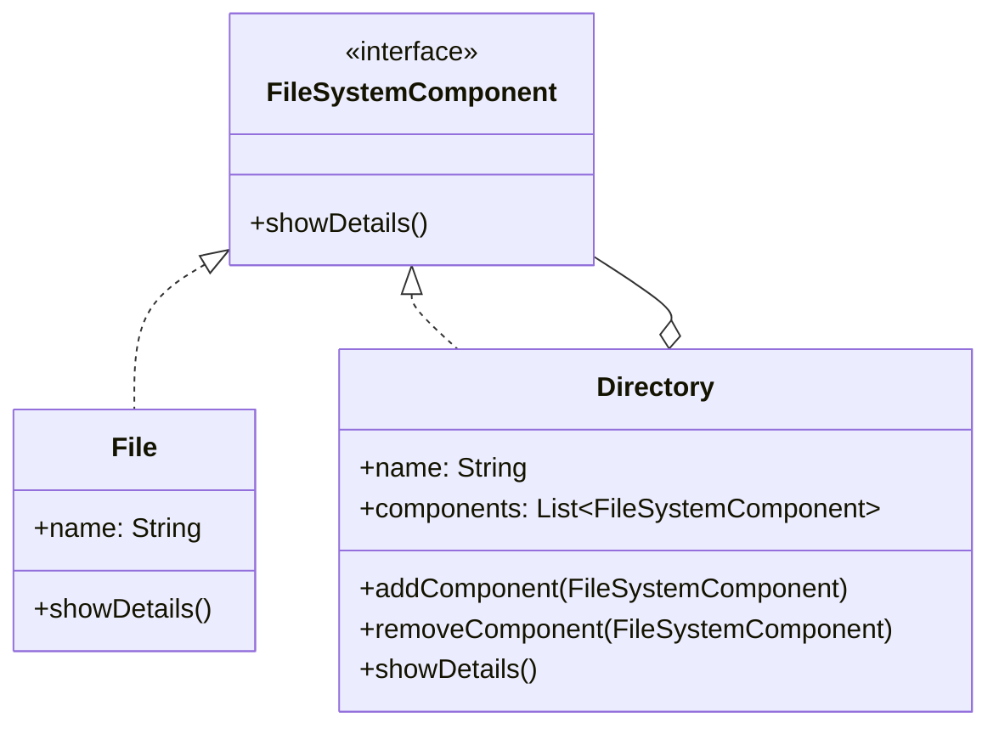

---

linkTitle: "3.3.1 Hierarchical Structures and Tree Algorithms"
title: "Hierarchical Structures and Tree Algorithms in Composite Pattern"
description: "Explore the Composite Pattern in Java for managing hierarchical structures and implementing tree algorithms. Learn how to treat individual objects and compositions uniformly with practical examples and UML diagrams."
categories:
- Java Design Patterns
- Structural Patterns
- Software Architecture
tags:
- Composite Pattern
- Hierarchical Structures
- Tree Algorithms
- Java Programming
- Design Patterns
date: 2024-10-25
type: docs
nav_weight: 331000
---

## 3.3.1 Hierarchical Structures and Tree Algorithms

The Composite Pattern is a structural design pattern that enables you to compose objects into tree structures to represent part-whole hierarchies. This pattern allows clients to treat individual objects and compositions of objects uniformly, simplifying the client code that interacts with complex structures.

### Understanding the Composite Pattern

The Composite Pattern is particularly useful when you need to work with tree-like structures, such as file systems, organizational charts, or GUI components. It allows you to build a structure of objects in the form of a tree, where each node can be either a leaf (an individual object) or a composite (a group of objects).

#### Key Components of the Composite Pattern

1. **Component Interface**: This defines the common operations for both leaf and composite nodes. It ensures that all elements in the hierarchy can be treated uniformly.

2. **Leaf Class**: Represents individual objects in the composition. Leaf nodes do not have any children.

3. **Composite Class**: Represents a group of objects. Composite nodes can contain both leaf nodes and other composite nodes, allowing for recursive structures.

### Hierarchical Data Examples

Hierarchical data is prevalent in many domains. Here are a few examples:

- **File Systems**: Directories can contain files or other directories, forming a tree structure.
- **Organizational Charts**: Departments can contain teams or individuals, each with their own hierarchy.
- **GUI Components**: Windows can contain panels, buttons, and other UI elements, each potentially containing more components.

### Implementing the Composite Pattern in Java

To illustrate the Composite Pattern, let's consider a simple example of a file system.

```java
// Component Interface
interface FileSystemComponent {
    void showDetails();
}

// Leaf Class
class File implements FileSystemComponent {
    private String name;

    public File(String name) {
        this.name = name;
    }

    @Override
    public void showDetails() {
        System.out.println("File: " + name);
    }
}

// Composite Class
class Directory implements FileSystemComponent {
    private String name;
    private List<FileSystemComponent> components = new ArrayList<>();

    public Directory(String name) {
        this.name = name;
    }

    public void addComponent(FileSystemComponent component) {
        components.add(component);
    }

    public void removeComponent(FileSystemComponent component) {
        components.remove(component);
    }

    @Override
    public void showDetails() {
        System.out.println("Directory: " + name);
        for (FileSystemComponent component : components) {
            component.showDetails();
        }
    }
}
```

### UML Diagram of the Composite Pattern

Below is a UML diagram illustrating the Composite Pattern:



### Recursive Algorithms in Composite Structures

One of the strengths of the Composite Pattern is its support for recursive algorithms, which are naturally suited for tree structures. For example, the `showDetails` method in the `Directory` class recursively calls `showDetails` on each component, allowing it to traverse the entire structure.

### Benefits of the Composite Pattern

- **Uniformity**: Clients can treat individual objects and compositions uniformly, simplifying the client code.
- **Extensibility**: New types of components can be added easily without affecting existing code.
- **Transparency**: The pattern hides the complexity of managing tree structures from the client.

### Challenges and Considerations

- **Managing Parent References**: If you need to navigate upwards in the tree, managing parent references can become complex.
- **Cycles**: Care must be taken to avoid cycles in the structure, which can lead to infinite loops in recursive algorithms.
- **Liskov Substitution Principle**: Ensure that components can be substituted without altering the desirable properties of the program.

### Promoting Transparency and Safety

The Composite Pattern promotes transparency by allowing clients to interact with complex structures without needing to know the details of their composition. It also enhances safety by enforcing a uniform interface for all components.

### Conclusion

The Composite Pattern is a powerful tool for managing hierarchical structures in Java applications. By treating individual objects and compositions uniformly, it simplifies client code and enhances the flexibility and maintainability of your applications. As you apply this pattern, consider the challenges and best practices discussed to ensure robust and efficient implementations.

## Quiz Time!



### What is the primary purpose of the Composite Pattern?

- [x] To treat individual objects and compositions uniformly
- [ ] To improve the performance of tree structures
- [ ] To enforce strict type checking in hierarchical data
- [ ] To simplify the creation of singleton objects

> **Explanation:** The Composite Pattern allows clients to treat individual objects and compositions of objects uniformly, which simplifies client code when dealing with complex structures.

### Which component in the Composite Pattern represents individual objects?

- [ ] Component Interface
- [x] Leaf Class
- [ ] Composite Class
- [ ] Client Class

> **Explanation:** The Leaf Class represents individual objects in the Composite Pattern, while the Composite Class represents a group of objects.

### What is a common example of hierarchical data?

- [ ] A flat list of items
- [x] A file system
- [ ] A single integer value
- [ ] A linear array

> **Explanation:** A file system is a common example of hierarchical data, where directories can contain files or other directories.

### What method is typically used to traverse a composite structure?

- [ ] Iterative algorithms
- [ ] Sorting algorithms
- [x] Recursive algorithms
- [ ] Hashing algorithms

> **Explanation:** Recursive algorithms are typically used to traverse composite structures, as they naturally fit the tree-like hierarchy.

### What is a potential challenge when using the Composite Pattern?

- [ ] Simplifying client code
- [ ] Increasing code flexibility
- [x] Managing parent references
- [ ] Enhancing performance

> **Explanation:** Managing parent references can be a challenge in the Composite Pattern, especially if upward navigation in the tree is required.

### Which design principle is important to follow when implementing the Composite Pattern?

- [ ] Open/Closed Principle
- [x] Liskov Substitution Principle
- [ ] Interface Segregation Principle
- [ ] Dependency Inversion Principle

> **Explanation:** The Liskov Substitution Principle is important to ensure that components can be substituted without altering the desirable properties of the program.

### How does the Composite Pattern promote transparency?

- [x] By allowing clients to interact with complex structures without knowing their composition
- [ ] By enforcing strict access control
- [ ] By improving the performance of recursive algorithms
- [ ] By reducing the number of classes in the hierarchy

> **Explanation:** The Composite Pattern promotes transparency by allowing clients to interact with complex structures without needing to know the details of their composition.

### What is the role of the Component Interface in the Composite Pattern?

- [ ] To represent individual objects
- [x] To define common operations for both leaves and composites
- [ ] To manage the lifecycle of composite objects
- [ ] To enforce type safety in the hierarchy

> **Explanation:** The Component Interface defines common operations for both leaves and composites, ensuring uniformity in the hierarchy.

### What is a benefit of using the Composite Pattern?

- [x] Simplifying client code
- [ ] Increasing the complexity of tree structures
- [ ] Reducing the number of classes needed
- [ ] Enhancing data security

> **Explanation:** One of the benefits of the Composite Pattern is that it simplifies client code by allowing uniform treatment of individual objects and compositions.

### The Composite Pattern is best suited for which type of data structure?

- [x] Tree structures
- [ ] Linear arrays
- [ ] Hash tables
- [ ] Linked lists

> **Explanation:** The Composite Pattern is best suited for tree structures, where it helps manage hierarchical data efficiently.


