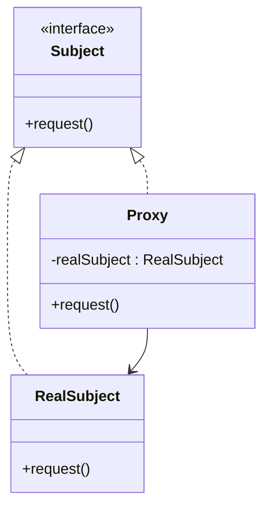

---

linkTitle: "3.5.1 Controlling Access to Objects"
title: "Proxy Pattern: Controlling Access to Objects in Java"
description: "Explore the Proxy Pattern in Java, a structural design pattern that provides a surrogate or placeholder for another object to control access, enhance functionality, and manage complexity."
categories:
- Java Design Patterns
- Structural Patterns
- Software Development
tags:
- Proxy Pattern
- Java
- Design Patterns
- Object-Oriented Design
- Software Architecture
date: 2024-10-25
type: docs
nav_weight: 351000
---

## 3.5.1 Controlling Access to Objects

In the realm of software design, managing how and when access to certain objects occurs can be crucial for maintaining system integrity, performance, and security. The Proxy Pattern, a structural design pattern, offers a solution by providing a surrogate or placeholder for another object to control access to it. This pattern introduces a level of indirection, which can be leveraged for various purposes such as lazy initialization, access control, logging, and more.

### Introduction to the Proxy Pattern

The Proxy Pattern involves creating a proxy class that represents the real subject. This proxy acts as an intermediary, controlling access to the real subject and potentially adding additional behavior. By doing so, it decouples the client from the complexities of the real subject, allowing for more flexible and maintainable code.

Here's a basic UML diagram illustrating the Proxy Pattern:



### Scenarios for Using a Proxy

There are several scenarios where direct access to an object is not desirable or feasible:

1. **Lazy Initialization**: The proxy can delay the creation of a resource-intensive object until it is actually needed, optimizing performance and resource usage.

2. **Access Control**: Proxies can enforce access restrictions, ensuring that only authorized clients can interact with the real subject.

3. **Logging and Auditing**: By intercepting requests to the real subject, proxies can log interactions for auditing purposes without modifying the real subject.

4. **Remote Proxies**: In distributed systems, a proxy can represent an object located on a remote server, handling the communication details transparently.

### Benefits of Using Proxies

- **Decoupling**: Clients interact with the proxy, which abstracts the complexities of the real subject.
- **Enhanced Functionality**: Proxies can add functionality such as caching, logging, or access control without altering the real subject.
- **Adherence to SOLID Principles**: The Proxy Pattern supports the Single Responsibility Principle by separating access control and additional behavior from the core functionality of the real subject. It also aligns with the Open/Closed Principle, allowing new behaviors to be added via proxies without modifying existing code.

### Types of Proxies

1. **Virtual Proxy**: Manages the creation and initialization of resource-intensive objects on demand.
2. **Protection Proxy**: Controls access to the real subject based on permissions.
3. **Remote Proxy**: Represents an object located in a different address space, handling communication between the client and the remote object.
4. **Smart Proxy**: Adds additional functionality such as reference counting or logging.

### Implementing a Proxy in Java

Let's explore a practical example of a Virtual Proxy in Java, where we delay the loading of a heavy object until it's needed.

```java
// Subject Interface
interface Image {
    void display();
}

// RealSubject
class RealImage implements Image {
    private String fileName;

    public RealImage(String fileName) {
        this.fileName = fileName;
        loadFromDisk();
    }

    private void loadFromDisk() {
        System.out.println("Loading " + fileName);
    }

    @Override
    public void display() {
        System.out.println("Displaying " + fileName);
    }
}

// Proxy
class ProxyImage implements Image {
    private RealImage realImage;
    private String fileName;

    public ProxyImage(String fileName) {
        this.fileName = fileName;
    }

    @Override
    public void display() {
        if (realImage == null) {
            realImage = new RealImage(fileName);
        }
        realImage.display();
    }
}

// Client
public class ProxyPatternDemo {
    public static void main(String[] args) {
        Image image = new ProxyImage("test_10mb.jpg");

        // Image will be loaded from disk
        image.display();
        System.out.println("");

        // Image will not be loaded from disk
        image.display();
    }
}
```

In this example, the `ProxyImage` class controls access to the `RealImage` object. The real image is only loaded from disk when `display()` is called for the first time, demonstrating lazy initialization.

### Assessing the Need for Proxies

When considering the use of proxies, it's essential to evaluate the specific requirements of your application. Proxies can introduce additional layers of abstraction, which may impact performance. Therefore, it's crucial to balance the benefits of using proxies against their potential overhead.

### Security Considerations

Proxies can play a significant role in enhancing security by controlling access to sensitive objects. However, it's vital to ensure that proxies themselves are secure and do not introduce vulnerabilities. This includes validating inputs, managing authentication and authorization, and ensuring that proxies do not inadvertently expose sensitive information.

### Transparency and Client Interaction

A well-designed proxy should be transparent to the client, meaning that the client should not need to be aware of whether it is interacting with a proxy or the real subject. This transparency ensures that changes to the underlying implementation do not affect client code, promoting maintainability and flexibility.

### Conclusion

The Proxy Pattern is a powerful tool for controlling access to objects in Java applications. By providing a surrogate for another object, proxies can add functionality, manage complexity, and enhance security without altering the real subject. As with any design pattern, it's essential to assess the specific needs of your application and consider the trade-offs involved in using proxies.

## Quiz Time!



### What is the primary purpose of the Proxy Pattern?

- [x] To provide a surrogate or placeholder for another object to control access.
- [ ] To manage object creation and initialization.
- [ ] To define a family of algorithms.
- [ ] To simplify complex subsystems.

> **Explanation:** The Proxy Pattern provides a surrogate or placeholder for another object to control access, adding a level of indirection.

### Which of the following is NOT a type of proxy?

- [ ] Virtual Proxy
- [ ] Protection Proxy
- [ ] Remote Proxy
- [x] Singleton Proxy

> **Explanation:** Singleton Proxy is not a recognized type of proxy. The other options are valid types of proxies.

### How does a Virtual Proxy enhance performance?

- [x] By delaying the creation of resource-intensive objects until needed.
- [ ] By controlling access based on permissions.
- [ ] By logging all interactions with the real subject.
- [ ] By managing remote communication.

> **Explanation:** A Virtual Proxy enhances performance by delaying the creation of resource-intensive objects until they are actually needed.

### What principle does the Proxy Pattern support by separating access control from core functionality?

- [x] Single Responsibility Principle
- [ ] Liskov Substitution Principle
- [ ] Interface Segregation Principle
- [ ] Dependency Inversion Principle

> **Explanation:** The Proxy Pattern supports the Single Responsibility Principle by separating access control and additional behavior from the core functionality of the real subject.

### In the provided Java example, when is the real image loaded from disk?

- [x] When the `display()` method is called for the first time.
- [ ] When the `ProxyImage` is created.
- [ ] When the `RealImage` is instantiated.
- [ ] When the application starts.

> **Explanation:** The real image is loaded from disk when the `display()` method is called for the first time, demonstrating lazy initialization.

### What is a key benefit of using a Remote Proxy?

- [x] It handles communication between the client and an object in a different address space.
- [ ] It logs all interactions with the real subject.
- [ ] It manages object creation and initialization.
- [ ] It controls access based on permissions.

> **Explanation:** A Remote Proxy handles communication between the client and an object located in a different address space, making remote interactions seamless.

### Why is transparency important in proxy design?

- [x] It ensures that client code is unaffected by changes to the underlying implementation.
- [ ] It allows proxies to add new functionality.
- [ ] It simplifies the client interface.
- [ ] It improves performance.

> **Explanation:** Transparency ensures that client code is unaffected by changes to the underlying implementation, promoting maintainability and flexibility.

### What is a potential downside of using proxies?

- [x] They can introduce additional layers of abstraction, impacting performance.
- [ ] They make the system more complex.
- [ ] They cannot add functionality to the real subject.
- [ ] They violate the Open/Closed Principle.

> **Explanation:** Proxies can introduce additional layers of abstraction, which may impact performance, especially if not managed carefully.

### Which scenario is NOT typically addressed by the Proxy Pattern?

- [ ] Lazy initialization
- [ ] Access control
- [ ] Logging
- [x] Sorting algorithms

> **Explanation:** Sorting algorithms are not typically addressed by the Proxy Pattern. The other scenarios are common use cases for proxies.

### True or False: A well-designed proxy should be transparent to the client.

- [x] True
- [ ] False

> **Explanation:** True. A well-designed proxy should be transparent to the client, meaning the client should not need to know whether it is interacting with a proxy or the real subject.




