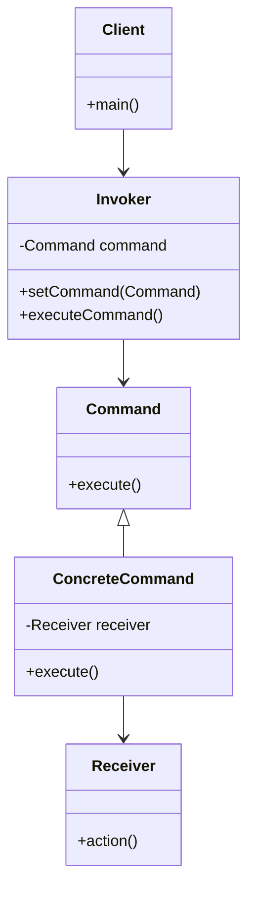

## 4.3.1 Encapsulating Requests as Objects

The Command pattern is a behavioral design pattern that turns a request into a stand-alone object containing all information about the request. This transformation allows for parameterization of clients with queues, requests, and operations, thereby providing a versatile mechanism for managing and executing commands. In this section, we'll delve into the intricacies of the Command pattern, its components, and its practical applications in Java.

### Introduction to the Command Pattern

The primary purpose of the Command pattern is to encapsulate a request as an object, thereby allowing for the decoupling of the sender (the object that invokes the operation) from the receiver (the object that knows how to perform the operation). This decoupling is crucial in scenarios where actions need to be recorded, queued, or executed at a later time.

#### Real-World Analogies

Consider a restaurant scenario where customers place orders. Each order can be thought of as a command. The waiter takes the order (invoker) and passes it to the kitchen (receiver), which then prepares the meal. Similarly, in software, the Command pattern can be used to implement undoable operations, such as in a text editor where each action (typing, deleting) can be undone.

### Key Components of the Command Pattern

The Command pattern involves several key roles:

- **Command**: This is an interface or abstract class that declares the method for executing the command.
- **ConcreteCommand**: This class implements the Command interface and defines the binding between the action and the receiver.
- **Receiver**: The object that knows how to perform the operations associated with carrying out a request.
- **Invoker**: The object that asks the command to carry out the request.
- **Client**: The object that creates the command and sets its receiver.

Let's visualize these components in a class diagram:



### Benefits of the Command Pattern

1. **Decoupling**: The pattern decouples the object that invokes the operation from the one that knows how to perform it, promoting a clean separation of concerns.
2. **Undoable Operations**: Commands can be stored for later execution, enabling undo and redo functionality.
3. **Transactional Behavior**: Commands can be executed as part of a transaction, allowing for rollback if necessary.
4. **Open/Closed Principle**: New commands can be added without modifying existing code, adhering to the Open/Closed Principle.

### Implementing the Command Pattern in Java

Let's implement a simple text editor using the Command pattern, focusing on undoable operations like typing and deleting text.

#### Step 1: Define the Command Interface

```java
public interface Command {
    void execute();
    void undo();
}
```

#### Step 2: Create Concrete Commands

```java
public class WriteCommand implements Command {
    private String text;
    private TextEditor editor;

    public WriteCommand(TextEditor editor, String text) {
        this.editor = editor;
        this.text = text;
    }

    @Override
    public void execute() {
        editor.write(text);
    }

    @Override
    public void undo() {
        editor.erase(text.length());
    }
}
```

```java
public class EraseCommand implements Command {
    private int length;
    private TextEditor editor;

    public EraseCommand(TextEditor editor, int length) {
        this.editor = editor;
        this.length = length;
    }

    @Override
    public void execute() {
        editor.erase(length);
    }

    @Override
    public void undo() {
        // Implement undo logic for erase
    }
}
```

#### Step 3: Implement the Receiver

```java
public class TextEditor {
    private StringBuilder content = new StringBuilder();

    public void write(String text) {
        content.append(text);
    }

    public void erase(int length) {
        int start = content.length() - length;
        content.delete(start, content.length());
    }

    public String getContent() {
        return content.toString();
    }
}
```

#### Step 4: Create the Invoker

```java
import java.util.Stack;

public class CommandManager {
    private Stack<Command> commandHistory = new Stack<>();

    public void executeCommand(Command command) {
        command.execute();
        commandHistory.push(command);
    }

    public void undo() {
        if (!commandHistory.isEmpty()) {
            Command command = commandHistory.pop();
            command.undo();
        }
    }
}
```

#### Step 5: Client Code

```java
public class Client {
    public static void main(String[] args) {
        TextEditor editor = new TextEditor();
        CommandManager manager = new CommandManager();

        Command writeHello = new WriteCommand(editor, "Hello");
        Command writeWorld = new WriteCommand(editor, " World");

        manager.executeCommand(writeHello);
        manager.executeCommand(writeWorld);

        System.out.println("Content: " + editor.getContent());

        manager.undo();
        System.out.println("After undo: " + editor.getContent());
    }
}
```

### Challenges and Considerations

- **Managing Command Objects**: Careful management of command objects is necessary to avoid memory leaks, especially when commands are queued or stored for long periods.
- **Concurrency**: When commands are executed concurrently, synchronization mechanisms might be needed to ensure thread safety.
- **Complexity**: The pattern can introduce complexity due to the increased number of classes and interfaces.

### Use Cases and Applications

1. **Macros**: Recording sequences of commands to be executed together.
2. **Multi-Level Undo**: Storing commands to enable multiple levels of undo and redo.
3. **Logging and Auditing**: Capturing commands for audit trails or debugging purposes.

### Integration with Other Patterns

The Command pattern can be combined with other patterns for enhanced functionality:

- **Composite Pattern**: To create complex commands composed of multiple simpler commands.
- **Observer Pattern**: To notify observers when commands are executed, providing real-time updates.

### Conclusion

The Command pattern is a powerful tool in the Java developer's arsenal, providing flexibility and extensibility in managing operations. By encapsulating requests as objects, it enables dynamic command execution, undoable operations, and a clean separation of concerns. As you design your applications, consider leveraging the Command pattern to enhance your system's architecture and maintainability.

## Quiz Time!



### What is the primary purpose of the Command pattern?

- [x] To encapsulate a request as an object
- [ ] To create a single instance of a class
- [ ] To provide a way to access elements of a collection
- [ ] To define a family of algorithms

> **Explanation:** The Command pattern encapsulates a request as an object, allowing for parameterization of clients with queues, requests, and operations.

### Which component in the Command pattern knows how to perform the operation?

- [ ] Command
- [ ] Invoker
- [x] Receiver
- [ ] Client

> **Explanation:** The Receiver is the component that knows how to perform the operations associated with carrying out a request.

### What role does the Invoker play in the Command pattern?

- [ ] It executes the command directly.
- [x] It asks the command to carry out the request.
- [ ] It creates the command and sets its receiver.
- [ ] It defines the binding between the action and the receiver.

> **Explanation:** The Invoker is responsible for asking the command to carry out the request.

### How does the Command pattern adhere to the Open/Closed Principle?

- [x] By allowing new commands to be added without changing existing code
- [ ] By ensuring only one instance of a class is created
- [ ] By providing a way to access elements of a collection
- [ ] By defining a family of algorithms

> **Explanation:** The Command pattern allows new commands to be added without modifying existing code, adhering to the Open/Closed Principle.

### Which of the following is a real-world analogy for the Command pattern?

- [x] Placing orders in a restaurant
- [ ] A single instance of a class
- [ ] A collection of elements
- [ ] A family of algorithms

> **Explanation:** Placing orders in a restaurant is a real-world analogy for the Command pattern, where orders are encapsulated as commands.

### What is a potential challenge when using the Command pattern?

- [x] Managing command objects and their life cycles
- [ ] Ensuring only one instance of a class is created
- [ ] Accessing elements of a collection
- [ ] Defining a family of algorithms

> **Explanation:** Managing command objects and their life cycles is a potential challenge when using the Command pattern.

### Which pattern can be combined with the Command pattern to create complex commands?

- [x] Composite Pattern
- [ ] Singleton Pattern
- [ ] Iterator Pattern
- [ ] Strategy Pattern

> **Explanation:** The Composite Pattern can be combined with the Command pattern to create complex commands composed of multiple simpler commands.

### How does the Command pattern support undoable operations?

- [x] By storing commands for later execution
- [ ] By ensuring only one instance of a class is created
- [ ] By providing a way to access elements of a collection
- [ ] By defining a family of algorithms

> **Explanation:** The Command pattern supports undoable operations by storing commands for later execution, enabling undo and redo functionality.

### What is the role of the Client in the Command pattern?

- [x] To create the command and set its receiver
- [ ] To execute the command directly
- [ ] To ask the command to carry out the request
- [ ] To know how to perform the operation

> **Explanation:** The Client is responsible for creating the command and setting its receiver.

### True or False: The Command pattern can be used to implement logging and auditing.

- [x] True
- [ ] False

> **Explanation:** True. The Command pattern can be used to capture commands for audit trails or debugging purposes.


