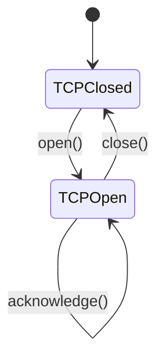

## 4.5.1 Managing Object Behavior Based on State

In software development, managing the behavior of objects that vary based on their internal state can be a complex task. The State pattern offers a robust solution, allowing objects to change their behavior dynamically as their state changes. This pattern encapsulates state-specific behavior into separate classes, promoting cleaner and more maintainable code.

### Introduction to the State Pattern

The State pattern is a behavioral design pattern that enables an object to alter its behavior when its internal state changes. It encapsulates state-specific behavior into separate classes, each representing a different state. This approach allows the object to delegate state-specific behavior to the appropriate state class, simplifying the management of state transitions and behavior changes.

### Real-World Scenarios and Analogies

Consider a vending machine as a real-world analogy. A vending machine dispenses products based on its state, such as "waiting for money," "dispensing product," or "out of stock." Each state dictates different behavior and interactions with users. Similarly, in software, objects like TCP connections or media players exhibit different behaviors based on their current state.

### Benefits of the State Pattern

The State pattern offers several advantages:

- **Avoids Complex Conditionals:** By encapsulating state-specific behavior, the pattern eliminates the need for complex conditional statements, improving code readability and organization.
- **Adheres to the Open/Closed Principle:** New states can be added without modifying existing code, enhancing flexibility and scalability.
- **Improves Code Maintainability:** By separating state logic into distinct classes, the pattern promotes cleaner and more maintainable code.

### Key Components of the State Pattern

The State pattern involves two primary components:

- **Context:** The context is the class that maintains a reference to the current state and delegates state-specific behavior to it. It provides an interface for clients to interact with and manages state transitions.
- **State Interface or Abstract Class:** The state interface defines the methods that concrete state classes must implement. Each concrete state class encapsulates behavior specific to a particular state.

### Implementing the State Pattern in Java

Let's explore a practical Java implementation of the State pattern using a simple example: a TCP connection.

```java
// State interface
interface TCPState {
    void open(TCPConnection connection);
    void close(TCPConnection connection);
    void acknowledge(TCPConnection connection);
}

// Concrete State classes
class TCPClosed implements TCPState {
    @Override
    public void open(TCPConnection connection) {
        System.out.println("Opening connection.");
        connection.setState(new TCPOpen());
    }

    @Override
    public void close(TCPConnection connection) {
        System.out.println("Connection already closed.");
    }

    @Override
    public void acknowledge(TCPConnection connection) {
        System.out.println("Can't acknowledge, connection is closed.");
    }
}

class TCPOpen implements TCPState {
    @Override
    public void open(TCPConnection connection) {
        System.out.println("Connection already open.");
    }

    @Override
    public void close(TCPConnection connection) {
        System.out.println("Closing connection.");
        connection.setState(new TCPClosed());
    }

    @Override
    public void acknowledge(TCPConnection connection) {
        System.out.println("Acknowledging data.");
    }
}

// Context class
class TCPConnection {
    private TCPState state;

    public TCPConnection() {
        state = new TCPClosed(); // Initial state
    }

    public void setState(TCPState state) {
        this.state = state;
    }

    public void open() {
        state.open(this);
    }

    public void close() {
        state.close(this);
    }

    public void acknowledge() {
        state.acknowledge(this);
    }
}
```

In this example, the `TCPConnection` class acts as the context, managing the current state and delegating behavior to the state classes. The `TCPState` interface defines the methods for state-specific behavior, implemented by the `TCPClosed` and `TCPOpen` classes.

### State Transitions and Consistency

Managing state transitions and maintaining consistency can be challenging. It's crucial to ensure that transitions are valid and that the context remains in a consistent state. This often involves carefully designing the state classes and their interactions.

### Testing and Maintainability

The State pattern enhances testability by allowing each state to be tested independently. This modular approach simplifies testing and debugging, as state-specific behavior is isolated in separate classes.

### Best Practices for Designing State Interfaces

- **Encapsulate State Logic:** Ensure that each state class encapsulates its logic, avoiding dependencies on other states.
- **Define Clear Interfaces:** Clearly define the state interface to ensure consistent behavior across different states.
- **Consider Performance:** Be mindful of performance implications when frequently switching states, especially in performance-critical applications.

### Integration with Other Patterns

The State pattern can be integrated with other design patterns, such as the Strategy pattern, to enhance flexibility. For instance, a Singleton pattern can be used to manage state instances if only one instance of each state is required.

### Visualizing State Transitions

State diagrams are useful tools for visualizing state transitions and behaviors. Here's a simple state diagram for the TCP connection example:



### Conclusion

The State pattern is a powerful tool for managing object behavior based on state changes. By encapsulating state-specific behavior into separate classes, it promotes cleaner, more maintainable code and adheres to the Open/Closed Principle. When designing applications with objects that exhibit significant behavior changes based on state, consider leveraging the State pattern to enhance flexibility and scalability.

## Quiz Time!



### What is the primary benefit of using the State pattern?

- [x] It allows objects to change behavior dynamically based on internal state changes.
- [ ] It simplifies object creation.
- [ ] It enhances data encapsulation.
- [ ] It reduces memory usage.

> **Explanation:** The State pattern enables objects to alter their behavior dynamically when their internal state changes, encapsulating state-specific behavior into separate classes.

### Which component of the State pattern maintains the current state?

- [ ] State Interface
- [ ] Concrete State Class
- [x] Context
- [ ] Strategy

> **Explanation:** The Context class maintains a reference to the current state and delegates state-specific behavior to it.

### How does the State pattern adhere to the Open/Closed Principle?

- [x] By allowing new states to be added without modifying existing code.
- [ ] By reducing the number of classes.
- [ ] By simplifying the user interface.
- [ ] By increasing performance.

> **Explanation:** The State pattern adheres to the Open/Closed Principle by allowing new states to be added without modifying existing code, enhancing flexibility.

### What is a potential challenge when using the State pattern?

- [ ] Reducing class count
- [ ] Enhancing encapsulation
- [x] Managing state transitions and maintaining consistency
- [ ] Simplifying object creation

> **Explanation:** Managing state transitions and maintaining consistency can be challenging when using the State pattern, requiring careful design.

### Which of the following is a real-world analogy for the State pattern?

- [ ] A car engine
- [x] A vending machine
- [ ] A light bulb
- [ ] A smartphone

> **Explanation:** A vending machine is a real-world analogy for the State pattern, as it dispenses products based on its state.

### What is the role of the State interface in the State pattern?

- [ ] To manage the current state
- [x] To define methods for state-specific behavior
- [ ] To simplify object creation
- [ ] To enhance data encapsulation

> **Explanation:** The State interface defines the methods that concrete state classes must implement, encapsulating state-specific behavior.

### How does the State pattern improve code maintainability?

- [x] By separating state logic into distinct classes
- [ ] By reducing the number of methods
- [ ] By simplifying the user interface
- [ ] By increasing performance

> **Explanation:** The State pattern improves code maintainability by separating state logic into distinct classes, promoting cleaner and more organized code.

### Which design pattern can be integrated with the State pattern for enhanced flexibility?

- [ ] Factory
- [ ] Observer
- [x] Strategy
- [ ] Prototype

> **Explanation:** The Strategy pattern can be integrated with the State pattern to enhance flexibility by allowing dynamic behavior changes.

### What is the initial state of the TCP connection in the provided example?

- [x] TCPClosed
- [ ] TCPOpen
- [ ] TCPEstablished
- [ ] TCPListening

> **Explanation:** In the provided example, the initial state of the TCP connection is `TCPClosed`.

### True or False: The State pattern can help avoid complex conditional statements.

- [x] True
- [ ] False

> **Explanation:** True. The State pattern encapsulates state-specific behavior into separate classes, helping to avoid complex conditional statements.


