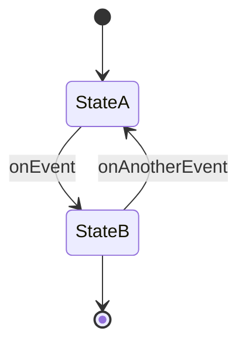

## 4.5.2 Implementing State Transitions

The State Pattern is a powerful behavioral design pattern that allows an object to alter its behavior when its internal state changes. This pattern is particularly useful when an object must change its behavior at runtime depending on its state. In this section, we'll explore how to implement state transitions using the State Pattern in Java, providing practical guidance, code examples, and best practices.

### Defining a `State` Interface

The first step in implementing the State Pattern is to define a `State` interface. This interface declares methods that represent actions the context can perform. Each method corresponds to an operation that might behave differently depending on the current state.

```java
public interface State {
    void handleRequest();
}
```

### Implementing Concrete State Classes

Concrete state classes implement the `State` interface and encapsulate the behavior associated with a particular state. Each concrete state class provides its own implementation of the methods defined in the `State` interface.

```java
public class ConcreteStateA implements State {
    @Override
    public void handleRequest() {
        System.out.println("Handling request in State A.");
    }
}

public class ConcreteStateB implements State {
    @Override
    public void handleRequest() {
        System.out.println("Handling request in State B.");
    }
}
```

### Context Class and State Management

The context class maintains a reference to the current state and delegates method calls to it. The context is responsible for managing state transitions, which can be triggered by invoking methods on the current state.

```java
public class Context {
    private State currentState;

    public Context(State initialState) {
        this.currentState = initialState;
    }

    public void setState(State state) {
        this.currentState = state;
    }

    public void request() {
        currentState.handleRequest();
    }
}
```

### Managing State Transitions

State transitions can be managed within the state classes or the context. In some cases, a state class might decide when to transition to another state, while in others, the context might control the transition logic.

#### State-Driven Transitions

In state-driven transitions, the state class itself determines when to change the state.

```java
public class ConcreteStateA implements State {
    private Context context;

    public ConcreteStateA(Context context) {
        this.context = context;
    }

    @Override
    public void handleRequest() {
        System.out.println("Handling request in State A.");
        context.setState(new ConcreteStateB(context));
    }
}
```

#### Context-Driven Transitions

Alternatively, the context can manage transitions based on external inputs or conditions.

```java
public class Context {
    private State currentState;

    public Context(State initialState) {
        this.currentState = initialState;
    }

    public void setState(State state) {
        this.currentState = state;
    }

    public void request() {
        currentState.handleRequest();
        if (/* some condition */) {
            setState(new ConcreteStateB(this));
        }
    }
}
```

### Best Practices for State Transitions

- **Ensure Valid Transitions:** Use validation logic to ensure that state transitions are valid and consistent. This can prevent illegal state changes that might lead to unexpected behavior.
  
- **Decouple States:** Avoid tight coupling between states by relying on interfaces. This makes it easier to add new states or modify existing ones without affecting other parts of the system.

- **Shared Behavior and Data:** If multiple states share behavior or data, consider using a base class or utility class to avoid code duplication.

- **Thread Safety:** When state transitions occur concurrently, ensure thread safety by synchronizing access to shared resources or using thread-safe data structures.

### Implementing State Diagrams into Code Logic

State diagrams are a useful tool for visualizing state transitions. Here's a simple example using Mermaid.js to represent a state diagram:



This diagram can be translated into code logic by implementing the transitions as described earlier.

### Documenting State Transitions

Documenting state transitions and behaviors is crucial for maintaining clarity and understanding. Consider using comments and documentation tools to describe the purpose and conditions of each state and transition.

### Testing Strategies for State Transitions

- **Unit Testing:** Write unit tests for each state class to ensure that it behaves correctly in isolation.
  
- **Integration Testing:** Test the context class to verify that state transitions occur as expected under various scenarios.

- **Edge Cases:** Consider edge cases and invalid transitions, ensuring that the system handles them gracefully.

### Extending the Pattern with New States or Behaviors

The State Pattern is inherently flexible, allowing for easy extension. To add a new state, simply create a new concrete state class and update the context or existing states to transition to it when appropriate.

### Handling Invalid State Transitions

Handle invalid state transitions gracefully by logging errors or throwing exceptions. This can help identify issues during development and prevent runtime errors in production.

### Optimizing State Management

- **Performance:** Minimize the overhead of state transitions by using efficient data structures and algorithms.
  
- **Memory Usage:** Consider the memory footprint of state objects, especially in systems with many states or frequent transitions.

### Conclusion

The State Pattern provides a robust framework for managing state-dependent behavior in Java applications. By defining clear interfaces, managing transitions effectively, and ensuring thread safety, developers can create flexible and maintainable systems. As you implement the State Pattern, remember to document your design, test thoroughly, and consider performance optimizations.

## Quiz Time!



### What is the primary purpose of the State Pattern?

- [x] To allow an object to alter its behavior when its internal state changes.
- [ ] To manage object creation in a flexible way.
- [ ] To provide a way to access the elements of an aggregate object sequentially.
- [ ] To define a family of algorithms and make them interchangeable.

> **Explanation:** The State Pattern allows an object to change its behavior when its internal state changes, making it appear as if the object has changed its class.

### Which of the following is a key component of the State Pattern?

- [x] State interface
- [ ] Singleton class
- [ ] Iterator interface
- [ ] Factory method

> **Explanation:** The State Pattern relies on a State interface that defines the actions that can be performed in different states.

### How can state transitions be managed in the State Pattern?

- [x] Within state classes or the context
- [ ] Only within the context
- [ ] Only within state classes
- [ ] Using a separate transition manager

> **Explanation:** State transitions can be managed either within the state classes or the context, depending on the design requirements.

### What is a best practice for ensuring valid state transitions?

- [x] Use validation logic to ensure transitions are consistent.
- [ ] Allow any transition between states.
- [ ] Use a global variable to manage state changes.
- [ ] Avoid using interfaces for state classes.

> **Explanation:** Validation logic helps ensure that state transitions are valid and consistent, preventing illegal state changes.

### How can you avoid tight coupling between state classes?

- [x] By using interfaces
- [ ] By using global variables
- [ ] By hardcoding transitions
- [ ] By using singletons

> **Explanation:** Using interfaces helps decouple state classes, making it easier to add or modify states without affecting other parts of the system.

### What should be considered for thread safety in state transitions?

- [x] Synchronizing access to shared resources
- [ ] Ignoring thread safety as it is not relevant
- [ ] Using global variables for state management
- [ ] Avoiding the use of interfaces

> **Explanation:** Synchronizing access to shared resources ensures thread safety when state transitions occur concurrently.

### How can shared behavior among state classes be handled?

- [x] By using a base class or utility class
- [ ] By duplicating code in each state class
- [ ] By using global variables
- [ ] By avoiding shared behavior

> **Explanation:** A base class or utility class can help avoid code duplication when multiple states share behavior or data.

### What is a common testing strategy for state transitions?

- [x] Unit testing state classes and integration testing the context
- [ ] Only unit testing the context
- [ ] Only integration testing state classes
- [ ] Ignoring testing for state transitions

> **Explanation:** Unit testing state classes and integration testing the context ensure that both individual states and their interactions are tested.

### What is the benefit of documenting state transitions?

- [x] It maintains clarity and understanding of the system.
- [ ] It increases the complexity of the system.
- [ ] It is unnecessary and can be skipped.
- [ ] It only benefits the original developer.

> **Explanation:** Documenting state transitions helps maintain clarity and understanding, which is beneficial for all developers involved.

### True or False: The State Pattern is not flexible and cannot be extended with new states.

- [ ] True
- [x] False

> **Explanation:** The State Pattern is flexible and can be easily extended with new states or behaviors.


