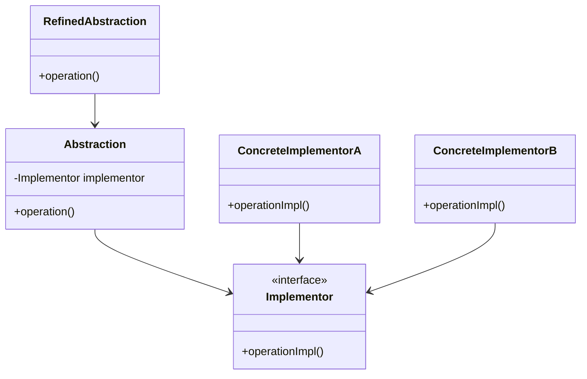

## 5.3.1 Understanding the Bridge Pattern

In the realm of software design, the Bridge Pattern stands out as a powerful structural pattern that addresses the challenge of decoupling abstraction from implementation, enabling them to vary independently. This pattern is particularly useful in scenarios where a system might face a combinatorial explosion of classes due to multiple dimensions of variation. By employing the Bridge Pattern, developers can achieve greater flexibility and scalability in their codebases.

### The Problem of Class Explosion

Before delving into the specifics of the Bridge Pattern, it's important to understand the problem it aims to solve: class explosion. In traditional inheritance-based designs, combining multiple dimensions of variation often leads to an exponential increase in the number of classes. For instance, consider a graphical application that supports multiple shapes (e.g., circles, squares) and multiple rendering methods (e.g., vector, raster). Using inheritance alone, you would need to create a separate class for each combination of shape and rendering method, quickly leading to a large and unwieldy class hierarchy.

This proliferation of classes not only complicates the codebase but also makes it difficult to introduce new shapes or rendering methods without modifying existing classes, violating the Open/Closed Principle.

### Real-World Analogy: Remote Controls and Devices

To better understand the Bridge Pattern, consider the analogy of remote controls and electronic devices. A remote control can be seen as an abstraction, while the electronic device (e.g., TV, DVD player) is the implementation. In the real world, a single remote control can operate different types of devices, and each device can be controlled by different types of remote controls. This separation allows for flexibility: new types of remote controls can be introduced without altering the devices, and new devices can be added without changing the existing remote controls.

### Key Components of the Bridge Pattern

The Bridge Pattern involves several key components:

1. **Abstraction**: This is the high-level control layer for some functionality. It defines the interface for the client to interact with and holds a reference to the implementor.

2. **Refined Abstraction**: This extends the abstraction to add more specific functionality. It still interacts with the implementor to perform its tasks.

3. **Implementor Interface**: This defines the interface for the implementation classes. It provides the low-level operations that the abstraction uses to perform high-level operations.

4. **Concrete Implementors**: These are the concrete classes that implement the `Implementor` interface. Each concrete implementor provides a different implementation of the interface.

Here's a visual representation of the Bridge Pattern:



### Promoting Flexibility and Scalability

The Bridge Pattern promotes flexibility and scalability by allowing both the abstraction and the implementation to evolve independently. This is achieved through the use of composition over inheritance. Instead of binding the abstraction to a specific implementation at compile time, the abstraction holds a reference to an implementor object, which can be set at runtime. This decoupling makes it easy to introduce new abstractions or implementations without affecting existing code.

### Composition Over Inheritance

The Bridge Pattern exemplifies the principle of composition over inheritance. By using composition, the pattern separates the abstraction from the implementation, allowing each to be extended independently. This approach not only reduces the dependency between abstraction and implementation but also enhances code reusability and maintainability.

### Identifying Dimensions of Change

A crucial step in applying the Bridge Pattern is identifying the different dimensions of change within the system. In the remote control analogy, the dimensions of change are the types of remote controls and the types of devices. By identifying these dimensions, developers can design a system that accommodates future changes without requiring extensive modifications.

### Abstraction and Implementation Hierarchies

Understanding the relationship between abstraction and implementation hierarchies is key to effectively applying the Bridge Pattern. The abstraction hierarchy defines the high-level operations available to clients, while the implementation hierarchy provides the low-level operations that actually perform the work. By maintaining separate hierarchies, the pattern allows each to evolve independently.

### Adhering to the Open/Closed Principle

The Bridge Pattern adheres to the Open/Closed Principle by enabling the addition of new abstractions and implementations without modifying existing code. This is achieved through the use of interfaces and abstract classes, which define the contract for both abstraction and implementation. As a result, new functionality can be introduced by simply adding new classes that implement these interfaces.

### Maintaining Consistent Interfaces

One of the challenges of the Bridge Pattern is maintaining consistent interfaces between the abstraction and implementor. The abstraction must provide a high-level interface that is intuitive for clients, while the implementor must provide a low-level interface that supports the required functionality. Ensuring consistency between these interfaces is crucial for the pattern to work effectively.

### Performance Considerations

While the Bridge Pattern offers significant benefits in terms of flexibility and scalability, it can also introduce performance overhead due to the added layers of abstraction. Each call to an operation in the abstraction must be delegated to the implementor, which can increase the number of method calls and, consequently, the execution time. Developers should weigh these trade-offs when deciding whether to use the Bridge Pattern.

### Updating Implementations

One of the key advantages of the Bridge Pattern is the ability to update implementations without affecting the abstraction layer. This is particularly useful in scenarios where the implementation might need to change frequently, such as when integrating with third-party libraries or services. By isolating the implementation behind an interface, changes can be made to the concrete implementors without impacting the abstraction.

### Communication Between Teams

In larger projects, different teams might be responsible for developing the abstraction and implementation layers. Clear communication between these teams is essential to ensure that the interfaces are consistent and that both layers work together seamlessly. Regular meetings and thorough documentation can help facilitate this communication.

### Documenting Roles and Responsibilities

To effectively implement the Bridge Pattern, it's important to document the roles and responsibilities of each component. This includes defining the responsibilities of the abstraction, refined abstraction, implementor interface, and concrete implementors. Clear documentation helps ensure that all team members understand how the pattern is applied and how each component interacts with the others.

### Practical Code Example

Let's explore a practical code example of the Bridge Pattern in JavaScript and TypeScript. We'll use the remote control and electronic device analogy to illustrate the pattern.

#### JavaScript Example

```javascript
// Implementor Interface
class Device {
    turnOn() {}
    turnOff() {}
}

// Concrete Implementors
class TV extends Device {
    turnOn() {
        console.log('Turning on the TV');
    }

    turnOff() {
        console.log('Turning off the TV');
    }
}

class Radio extends Device {
    turnOn() {
        console.log('Turning on the Radio');
    }

    turnOff() {
        console.log('Turning off the Radio');
    }
}

// Abstraction
class RemoteControl {
    constructor(device) {
        this.device = device;
    }

    togglePower() {
        console.log('Toggling power');
        // Assume some logic to determine current state
        this.device.turnOn();
    }
}

// Refined Abstraction
class AdvancedRemoteControl extends RemoteControl {
    mute() {
        console.log('Muting the device');
        // Implement muting logic
    }
}

// Usage
const tv = new TV();
const radio = new Radio();

const remoteForTV = new RemoteControl(tv);
remoteForTV.togglePower();

const advancedRemoteForRadio = new AdvancedRemoteControl(radio);
advancedRemoteForRadio.togglePower();
advancedRemoteForRadio.mute();
```

#### TypeScript Example

```typescript
// Implementor Interface
interface Device {
    turnOn(): void;
    turnOff(): void;
}

// Concrete Implementors
class TV implements Device {
    turnOn(): void {
        console.log('Turning on the TV');
    }

    turnOff(): void {
        console.log('Turning off the TV');
    }
}

class Radio implements Device {
    turnOn(): void {
        console.log('Turning on the Radio');
    }

    turnOff(): void {
        console.log('Turning off the Radio');
    }
}

// Abstraction
class RemoteControl {
    protected device: Device;

    constructor(device: Device) {
        this.device = device;
    }

    togglePower(): void {
        console.log('Toggling power');
        // Assume some logic to determine current state
        this.device.turnOn();
    }
}

// Refined Abstraction
class AdvancedRemoteControl extends RemoteControl {
    mute(): void {
        console.log('Muting the device');
        // Implement muting logic
    }
}

// Usage
const tv = new TV();
const radio = new Radio();

const remoteForTV = new RemoteControl(tv);
remoteForTV.togglePower();

const advancedRemoteForRadio = new AdvancedRemoteControl(radio);
advancedRemoteForRadio.togglePower();
advancedRemoteForRadio.mute();
```

### Best Practices and Common Pitfalls

When implementing the Bridge Pattern, consider the following best practices and common pitfalls:

- **Best Practices**:
  - Clearly define the interfaces for both abstraction and implementation.
  - Use composition to maintain flexibility and scalability.
  - Ensure that the abstraction and implementation can evolve independently.
  - Document the roles and responsibilities of each component.

- **Common Pitfalls**:
  - Overcomplicating the design by introducing unnecessary layers of abstraction.
  - Failing to maintain consistent interfaces between the abstraction and implementor.
  - Neglecting performance considerations when adding layers of abstraction.

### Conclusion

The Bridge Pattern is a powerful tool in the software architect's toolkit, providing a means to decouple abstraction from implementation and allowing them to vary independently. By applying this pattern, developers can create flexible and scalable systems that are easier to maintain and extend. However, it's important to carefully consider the trade-offs involved, particularly in terms of performance and complexity.

By understanding the key components of the Bridge Pattern and how they interact, developers can effectively apply this pattern to solve real-world design challenges. Whether you're dealing with a complex system with multiple dimensions of variation or simply looking to improve the flexibility of your codebase, the Bridge Pattern offers a robust solution.

## Quiz Time!



### What is the main purpose of the Bridge Pattern?

- [x] To decouple abstraction from implementation, allowing them to vary independently.
- [ ] To increase the number of classes in a hierarchy.
- [ ] To improve performance by reducing the number of method calls.
- [ ] To simplify code by merging abstraction and implementation.

> **Explanation:** The Bridge Pattern is designed to decouple abstraction from implementation, enabling them to vary independently and reducing the complexity of class hierarchies.

### Which problem does the Bridge Pattern primarily address?

- [x] Class explosion due to combining multiple dimensions of variation through inheritance.
- [ ] Poor performance due to excessive method calls.
- [ ] Lack of flexibility in procedural programming.
- [ ] Difficulty in understanding complex algorithms.

> **Explanation:** The Bridge Pattern addresses the problem of class explosion, which occurs when multiple dimensions of variation are combined through inheritance, leading to a large number of classes.

### In the Bridge Pattern, what role does the Implementor Interface play?

- [x] It defines the interface for the implementation classes.
- [ ] It provides the high-level operations for clients.
- [ ] It extends the abstraction to add more specific functionality.
- [ ] It represents a concrete implementation of the abstraction.

> **Explanation:** The Implementor Interface defines the interface for the implementation classes, providing the low-level operations used by the abstraction.

### How does the Bridge Pattern promote flexibility in code design?

- [x] By allowing both the abstraction and the implementation to evolve independently.
- [ ] By merging abstraction and implementation into a single class.
- [ ] By reducing the number of classes in the system.
- [ ] By eliminating the need for interfaces.

> **Explanation:** The Bridge Pattern promotes flexibility by allowing the abstraction and implementation to evolve independently, using composition over inheritance.

### What is a potential performance consideration when using the Bridge Pattern?

- [x] Increased method calls due to added layers of abstraction.
- [ ] Decreased readability due to fewer classes.
- [ ] Reduced scalability due to tightly coupled code.
- [ ] Increased complexity due to lack of interfaces.

> **Explanation:** The Bridge Pattern can introduce performance overhead due to increased method calls, as each operation in the abstraction is delegated to the implementor.

### How does the Bridge Pattern adhere to the Open/Closed Principle?

- [x] By enabling the addition of new abstractions and implementations without modifying existing code.
- [ ] By merging abstraction and implementation into a single class.
- [ ] By reducing the number of classes in the system.
- [ ] By eliminating the need for interfaces.

> **Explanation:** The Bridge Pattern adheres to the Open/Closed Principle by allowing new abstractions and implementations to be added without modifying existing code, through the use of interfaces and abstract classes.

### What is a common pitfall when implementing the Bridge Pattern?

- [x] Overcomplicating the design by introducing unnecessary layers of abstraction.
- [ ] Failing to use inheritance for all classes.
- [ ] Merging abstraction and implementation into a single class.
- [ ] Eliminating the need for interfaces.

> **Explanation:** A common pitfall when implementing the Bridge Pattern is overcomplicating the design by introducing unnecessary layers of abstraction, which can lead to increased complexity.

### What is the role of the Refined Abstraction in the Bridge Pattern?

- [x] It extends the abstraction to add more specific functionality.
- [ ] It defines the interface for the implementation classes.
- [ ] It represents a concrete implementation of the abstraction.
- [ ] It provides the low-level operations for the abstraction.

> **Explanation:** The Refined Abstraction extends the abstraction to add more specific functionality, while still interacting with the implementor to perform its tasks.

### Which of the following is a key component of the Bridge Pattern?

- [x] Abstraction
- [ ] Singleton
- [ ] Observer
- [ ] Factory

> **Explanation:** The Abstraction is a key component of the Bridge Pattern, providing the high-level control layer for some functionality.

### True or False: The Bridge Pattern uses inheritance to achieve decoupling between abstraction and implementation.

- [ ] True
- [x] False

> **Explanation:** False. The Bridge Pattern uses composition over inheritance to achieve decoupling between abstraction and implementation, allowing them to vary independently.


