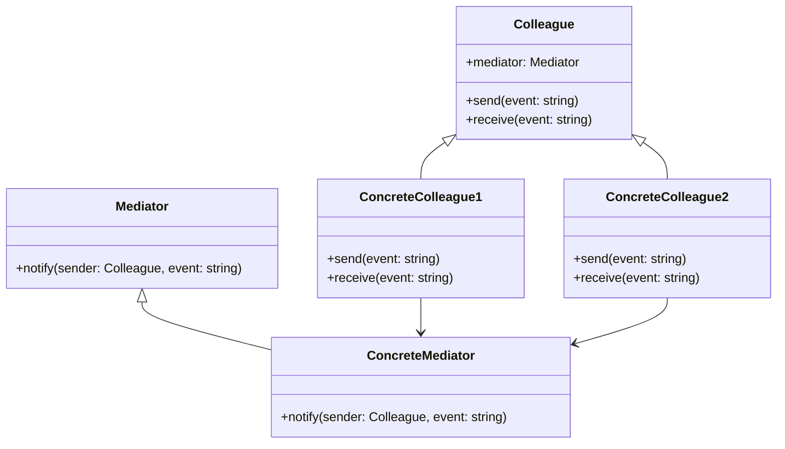

## 6.2.1 Understanding the Mediator Pattern

The Mediator pattern is a behavioral design pattern that aims to reduce the complexity of communication between multiple objects or components by introducing a single mediator object that handles the interactions. This pattern is particularly useful in scenarios where multiple objects need to interact with each other in complex and dynamic ways, as it helps to decouple the objects and centralizes the control logic.

### Defining the Mediator Pattern

The Mediator pattern serves as an intermediary for communication between objects. Instead of objects communicating directly with each other, they communicate through the mediator. This reduces the dependencies between communicating objects, making the system easier to maintain and extend.

#### Purpose of the Mediator Pattern

- **Decoupling Objects:** By using a mediator, objects no longer need to know about each other's existence. They only need to know about the mediator, which reduces the number of dependencies and potential points of failure.
- **Centralizing Control Logic:** The mediator centralizes the control logic that governs the interactions between objects, making it easier to manage and modify.
- **Enhancing Flexibility and Maintainability:** With reduced coupling, the system becomes more flexible and easier to maintain. Changes to one object do not necessarily require changes to other objects.

### How Objects Communicate Through a Mediator

In the Mediator pattern, objects (often referred to as "Colleagues") do not communicate with each other directly. Instead, they send messages to the mediator, which then forwards the messages to the appropriate recipients. This indirect communication model can be likened to a hub-and-spoke system, where the mediator is the hub and the colleagues are the spokes.

#### Real-World Analogy: Air Traffic Control

A classic analogy for the Mediator pattern is air traffic control. In an airport, planes do not communicate directly with each other to coordinate takeoffs and landings. Instead, they communicate with the air traffic control tower, which acts as a mediator. The tower ensures that planes take off and land safely by coordinating their movements, much like a mediator coordinates the interactions between objects.

### Scenarios for Using the Mediator Pattern

The Mediator pattern is particularly useful in scenarios where multiple objects interact in complex ways. For example:

- **User Interface Components:** In a complex UI, various components like buttons, text fields, and sliders may need to interact with each other. A mediator can manage these interactions, ensuring that changes in one component are reflected appropriately in others.
- **Chat Applications:** In a chat application, a mediator can manage the communication between users, ensuring that messages are delivered to the correct recipients.
- **Workflow Systems:** In systems where multiple processes or tasks need to be coordinated, a mediator can manage the flow of information and control between different components.

### Key Components of the Mediator Pattern

The Mediator pattern consists of several key components:

- **Mediator Interface:** This defines the interface for communication between the mediator and colleague objects. It typically includes methods for sending and receiving messages.
- **Concrete Mediator:** This is the implementation of the mediator interface. It coordinates the communication between colleague objects and contains the logic for managing their interactions.
- **Colleague Classes:** These are the objects that communicate through the mediator. They hold a reference to the mediator and use it to send and receive messages.

#### Diagram of the Mediator Pattern

Below is a diagram representing the Mediator pattern:



### Centralizing Control Logic

By centralizing control logic within the mediator, the pattern simplifies the management of complex interactions. This centralization allows for:

- **Easier Modifications:** Changes to interaction logic can be made in one place (the mediator) rather than across multiple objects.
- **Consistent Behavior:** The mediator ensures that interactions follow a consistent pattern, reducing the likelihood of errors.

### Benefits of the Mediator Pattern

The Mediator pattern offers several benefits:

- **Improved Maintainability:** With reduced coupling, the system becomes easier to maintain. Changes to one component are less likely to affect others.
- **Enhanced Flexibility:** The centralized control logic allows for easy modification and extension of interaction rules.
- **Simplified Communication:** Objects do not need to manage complex communication logic, as this is handled by the mediator.

### Potential Challenges

While the Mediator pattern offers many benefits, it also presents some challenges:

- **Mediator as a Bottleneck:** If the mediator becomes too complex, it can become a bottleneck, slowing down the system and making it difficult to manage.
- **Overly Complex Mediator:** A mediator that handles too many responsibilities can become difficult to understand and maintain.

#### Balancing Decentralization and Control

When implementing the Mediator pattern, it's important to strike a balance between decentralization and control. While the mediator centralizes control logic, it should not become a monolithic component that handles all interactions. Instead, it should delegate responsibilities appropriately and remain focused on coordination.

### Adherence to Design Principles

The Mediator pattern adheres to several key design principles:

- **Single Responsibility Principle:** By centralizing communication logic, each colleague object has a single responsibility and does not need to manage interactions with other objects.
- **Open/Closed Principle:** The mediator can be extended with new interaction rules without modifying existing code, enhancing flexibility and reducing the risk of introducing errors.

### Designing an Extendable Mediator

To design a mediator that is easy to extend:

- **Define Clear Interfaces:** Use interfaces to define the communication methods between the mediator and colleagues, allowing for easy extension and modification.
- **Modularize Logic:** Break down complex interaction logic into smaller, manageable modules that can be independently modified and extended.
- **Document Responsibilities:** Clearly document the mediator's responsibilities and interactions to ensure that future developers can easily understand and extend the system.

### Avoiding Tight Coupling

To avoid tight coupling between colleagues and the mediator:

- **Use Interfaces:** Define interfaces for communication, allowing colleagues to interact with the mediator without being tightly coupled to its implementation.
- **Encapsulate Logic:** Encapsulate communication logic within the mediator, preventing colleagues from needing to know about each other's internal workings.

### Handling Multiple Mediators

In larger systems, it may be necessary to use multiple mediators to manage different sets of interactions. When handling multiple mediators:

- **Define Clear Boundaries:** Clearly define the boundaries and responsibilities of each mediator to avoid overlap and confusion.
- **Coordinate Between Mediators:** If necessary, implement mechanisms for coordinating interactions between different mediators to ensure consistent behavior across the system.

### Practical Code Example

Let's explore a practical implementation of the Mediator pattern in JavaScript and TypeScript.

#### JavaScript Example

```javascript
// Mediator Interface
class Mediator {
    notify(sender, event) {}
}

// Concrete Mediator
class ConcreteMediator extends Mediator {
    constructor() {
        super();
        this.colleague1 = null;
        this.colleague2 = null;
    }

    setColleague1(colleague) {
        this.colleague1 = colleague;
    }

    setColleague2(colleague) {
        this.colleague2 = colleague;
    }

    notify(sender, event) {
        if (event === 'event1') {
            console.log('Mediator reacts on event1 and triggers the following operations:');
            this.colleague2.doSomething();
        }
        if (event === 'event2') {
            console.log('Mediator reacts on event2 and triggers the following operations:');
            this.colleague1.doSomething();
        }
    }
}

// Colleague Class
class Colleague {
    constructor(mediator) {
        this.mediator = mediator;
    }

    send(event) {
        this.mediator.notify(this, event);
    }
}

// Concrete Colleague 1
class ConcreteColleague1 extends Colleague {
    doSomething() {
        console.log('ConcreteColleague1 does something.');
    }
}

// Concrete Colleague 2
class ConcreteColleague2 extends Colleague {
    doSomething() {
        console.log('ConcreteColleague2 does something.');
    }
}

// Usage
const mediator = new ConcreteMediator();
const colleague1 = new ConcreteColleague1(mediator);
const colleague2 = new ConcreteColleague2(mediator);

mediator.setColleague1(colleague1);
mediator.setColleague2(colleague2);

colleague1.send('event1');
colleague2.send('event2');
```

#### TypeScript Example

```typescript
// Mediator Interface
interface Mediator {
    notify(sender: Colleague, event: string): void;
}

// Concrete Mediator
class ConcreteMediator implements Mediator {
    private colleague1: ConcreteColleague1;
    private colleague2: ConcreteColleague2;

    setColleague1(colleague: ConcreteColleague1): void {
        this.colleague1 = colleague;
    }

    setColleague2(colleague: ConcreteColleague2): void {
        this.colleague2 = colleague;
    }

    notify(sender: Colleague, event: string): void {
        if (event === 'event1') {
            console.log('Mediator reacts on event1 and triggers the following operations:');
            this.colleague2.doSomething();
        }
        if (event === 'event2') {
            console.log('Mediator reacts on event2 and triggers the following operations:');
            this.colleague1.doSomething();
        }
    }
}

// Colleague Class
class Colleague {
    constructor(protected mediator: Mediator) {}

    send(event: string): void {
        this.mediator.notify(this, event);
    }
}

// Concrete Colleague 1
class ConcreteColleague1 extends Colleague {
    doSomething(): void {
        console.log('ConcreteColleague1 does something.');
    }
}

// Concrete Colleague 2
class ConcreteColleague2 extends Colleague {
    doSomething(): void {
        console.log('ConcreteColleague2 does something.');
    }
}

// Usage
const mediator = new ConcreteMediator();
const colleague1 = new ConcreteColleague1(mediator);
const colleague2 = new ConcreteColleague2(mediator);

mediator.setColleague1(colleague1);
mediator.setColleague2(colleague2);

colleague1.send('event1');
colleague2.send('event2');
```

### Conclusion

The Mediator pattern is a powerful tool for managing complex interactions between objects in a system. By centralizing communication logic, it reduces coupling and enhances maintainability and flexibility. However, it is important to carefully design the mediator to avoid it becoming a bottleneck or overly complex. By adhering to design principles and documenting responsibilities, developers can create systems that are both robust and easy to extend.

### Further Reading and Resources

- **Books:** "Design Patterns: Elements of Reusable Object-Oriented Software" by Erich Gamma et al.
- **Articles:** "Understanding the Mediator Pattern in JavaScript" on various software development blogs.
- **Online Courses:** Courses on design patterns available on platforms like Coursera and Udemy.
- **Documentation:** Official documentation for JavaScript and TypeScript for understanding language-specific implementations.

## Quiz Time!



### What is the primary purpose of the Mediator pattern?

- [x] To reduce coupling among interacting objects
- [ ] To increase coupling among interacting objects
- [ ] To simplify object creation
- [ ] To enhance object inheritance

> **Explanation:** The Mediator pattern reduces coupling among interacting objects by centralizing communication through a mediator.

### How do objects communicate in the Mediator pattern?

- [x] Through a mediator
- [ ] Directly with each other
- [ ] Through a shared global variable
- [ ] By inheriting from a common superclass

> **Explanation:** In the Mediator pattern, objects communicate through a mediator rather than directly with each other.

### Which real-world analogy is commonly used to explain the Mediator pattern?

- [x] Air traffic control coordinating planes
- [ ] A library lending books
- [ ] A restaurant serving food
- [ ] A teacher instructing students

> **Explanation:** Air traffic control is a common analogy for the Mediator pattern, as it coordinates communication between planes.

### What are the key components of the Mediator pattern?

- [x] Mediator Interface, Concrete Mediator, Colleague Classes
- [ ] Singleton, Factory, Adapter
- [ ] Proxy, Decorator, Observer
- [ ] Command, Strategy, Visitor

> **Explanation:** The key components of the Mediator pattern are the Mediator Interface, Concrete Mediator, and Colleague Classes.

### What is a potential challenge when using the Mediator pattern?

- [x] The mediator becoming a bottleneck
- [ ] Increased coupling between objects
- [ ] Difficulty in object creation
- [ ] Reduced flexibility

> **Explanation:** A potential challenge of the Mediator pattern is the mediator becoming a bottleneck if it handles too many responsibilities.

### How does the Mediator pattern adhere to the Single Responsibility Principle?

- [x] By centralizing communication logic, each colleague object has a single responsibility
- [ ] By allowing colleagues to manage their own interactions
- [ ] By increasing the number of responsibilities for each object
- [ ] By decentralizing control logic

> **Explanation:** The Mediator pattern adheres to the Single Responsibility Principle by centralizing communication logic, giving each colleague object a single responsibility.

### What should be considered when designing an extendable mediator?

- [x] Define clear interfaces and modularize logic
- [ ] Avoid using interfaces
- [ ] Centralize all system logic in the mediator
- [ ] Use global variables for communication

> **Explanation:** When designing an extendable mediator, it's important to define clear interfaces and modularize logic to allow for easy extension.

### How can tight coupling between colleagues and the mediator be avoided?

- [x] Use interfaces for communication
- [ ] Allow colleagues to communicate directly
- [ ] Use global variables for communication
- [ ] Avoid using interfaces

> **Explanation:** Tight coupling can be avoided by using interfaces for communication, allowing colleagues to interact with the mediator without being tightly coupled to its implementation.

### In larger systems, how can multiple mediators be managed?

- [x] Define clear boundaries and coordinate between mediators
- [ ] Use a single mediator for all interactions
- [ ] Avoid using mediators
- [ ] Use global variables for communication

> **Explanation:** In larger systems, managing multiple mediators involves defining clear boundaries and coordinating between mediators to ensure consistent behavior.

### True or False: The Mediator pattern simplifies communication by having objects communicate directly with each other.

- [ ] True
- [x] False

> **Explanation:** False. The Mediator pattern simplifies communication by having objects communicate through a mediator, not directly with each other.


