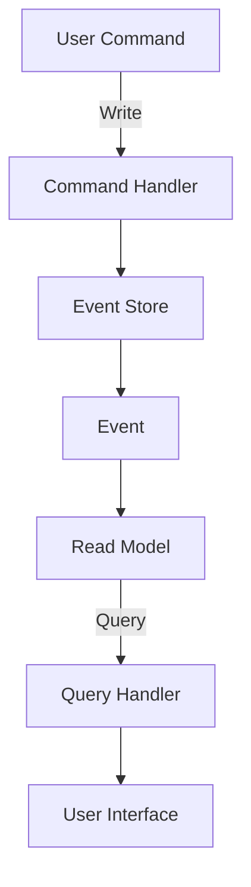

---

linkTitle: "6.4.4 Patterns for Responsive Applications"
title: "Patterns for Responsive Applications: Leveraging Reactive Programming"
description: "Explore design patterns for building responsive and resilient applications using reactive programming principles in Java."
categories:
- Java Design Patterns
- Reactive Programming
- Software Architecture
tags:
- Reactive Programming
- Observer Pattern
- Publisher-Subscriber
- Backpressure
- Circuit Breaker
- Bulkhead Pattern
- Event Sourcing
- CQRS
- Asynchronous Messaging
- State Management
date: 2024-10-25
type: docs
nav_weight: 6440

---

## 6.4.4 Patterns for Responsive Applications

In an increasingly connected world, applications must be responsive, resilient, and capable of handling high loads and unpredictable conditions. Reactive programming offers a paradigm shift to achieve these goals by focusing on asynchronous data streams and the propagation of change. This section explores various patterns that leverage reactive programming principles to build robust applications in Java.

### The Observer Pattern in Reactive Programming

The **Observer Pattern** is foundational to reactive programming, facilitating event-driven architectures where components react to changes in state or events. In Java, this pattern is often implemented using the `Observer` and `Observable` classes, though modern approaches utilize reactive libraries like RxJava or Project Reactor.

#### Example: Observer Pattern with RxJava

```java
import io.reactivex.Observable;
import io.reactivex.Observer;
import io.reactivex.disposables.Disposable;

public class ObserverPatternExample {
    public static void main(String[] args) {
        Observable<String> messageStream = Observable.just("Hello", "Reactive", "World");

        Observer<String> messageObserver = new Observer<String>() {
            @Override
            public void onSubscribe(Disposable d) {
                System.out.println("Subscribed to message stream");
            }

            @Override
            public void onNext(String message) {
                System.out.println("Received message: " + message);
            }

            @Override
            public void onError(Throwable e) {
                System.err.println("Error occurred: " + e.getMessage());
            }

            @Override
            public void onComplete() {
                System.out.println("All messages received");
            }
        };

        messageStream.subscribe(messageObserver);
    }
}
```

### Publisher-Subscriber Pattern for Scalability

The **Publisher-Subscriber Pattern** decouples components by allowing publishers to emit events without knowing the subscribers. This pattern enhances scalability and flexibility, as new subscribers can be added without altering the publisher.

#### Example: Publisher-Subscriber with EventBus

```java
import com.google.common.eventbus.EventBus;
import com.google.common.eventbus.Subscribe;

public class EventBusExample {
    static class EventListener {
        @Subscribe
        public void handleEvent(String event) {
            System.out.println("Handled event: " + event);
        }
    }

    public static void main(String[] args) {
        EventBus eventBus = new EventBus();
        EventListener listener = new EventListener();
        eventBus.register(listener);

        eventBus.post("Event 1");
        eventBus.post("Event 2");
    }
}
```

### Managing Flow with Backpressure

**Backpressure** is crucial in reactive systems to prevent overload by controlling the flow of data between producers and consumers. Reactive libraries provide mechanisms to handle backpressure, ensuring systems remain stable under load.

#### Example: Backpressure with Project Reactor

```java
import reactor.core.publisher.Flux;
import reactor.core.scheduler.Schedulers;

public class BackpressureExample {
    public static void main(String[] args) {
        Flux.range(1, 1000)
            .onBackpressureDrop()
            .publishOn(Schedulers.parallel())
            .subscribe(i -> {
                try {
                    Thread.sleep(50); // Simulate slow consumer
                    System.out.println("Processing item: " + i);
                } catch (InterruptedException e) {
                    e.printStackTrace();
                }
            });
    }
}
```

### Circuit Breaker Pattern for Robustness

The **Circuit Breaker Pattern** helps manage failures gracefully by breaking the circuit (stopping requests) when a service is detected to be failing, and then retrying after a specified period.

#### Example: Circuit Breaker with Resilience4j

```java
import io.github.resilience4j.circuitbreaker.CircuitBreaker;
import io.github.resilience4j.circuitbreaker.CircuitBreakerConfig;
import io.github.resilience4j.circuitbreaker.CircuitBreakerRegistry;

import java.time.Duration;

public class CircuitBreakerExample {
    public static void main(String[] args) {
        CircuitBreakerConfig config = CircuitBreakerConfig.custom()
                .failureRateThreshold(50)
                .waitDurationInOpenState(Duration.ofSeconds(10))
                .build();

        CircuitBreakerRegistry registry = CircuitBreakerRegistry.of(config);
        CircuitBreaker circuitBreaker = registry.circuitBreaker("example");

        Runnable decoratedRunnable = CircuitBreaker.decorateRunnable(circuitBreaker, () -> {
            // Simulate a service call
            System.out.println("Service call");
            throw new RuntimeException("Service failure");
        });

        try {
            decoratedRunnable.run();
        } catch (Exception e) {
            System.out.println("Caught exception: " + e.getMessage());
        }
    }
}
```

### Bulkhead Pattern for Isolation

The **Bulkhead Pattern** isolates different components or services to prevent cascading failures, much like compartments in a ship.

#### Example: Bulkhead with Resilience4j

```java
import io.github.resilience4j.bulkhead.Bulkhead;
import io.github.resilience4j.bulkhead.BulkheadConfig;
import io.github.resilience4j.bulkhead.BulkheadRegistry;

public class BulkheadExample {
    public static void main(String[] args) {
        BulkheadConfig config = BulkheadConfig.custom()
                .maxConcurrentCalls(5)
                .build();

        BulkheadRegistry registry = BulkheadRegistry.of(config);
        Bulkhead bulkhead = registry.bulkhead("example");

        Runnable decoratedRunnable = Bulkhead.decorateRunnable(bulkhead, () -> {
            // Simulate a service call
            System.out.println("Service call");
        });

        for (int i = 0; i < 10; i++) {
            new Thread(decoratedRunnable).start();
        }
    }
}
```

### Event Sourcing and CQRS in Reactive Systems

**Event Sourcing** and **CQRS (Command Query Responsibility Segregation)** are architectural patterns that fit well with reactive systems. Event Sourcing stores state changes as a sequence of events, while CQRS separates read and write operations, improving scalability and performance.

#### Diagram: Event Sourcing and CQRS



### Asynchronous Messaging and Event Buses

**Asynchronous Messaging** and **Event Buses** are essential for decoupling modules in a reactive system, allowing components to communicate without blocking.

#### Example: Asynchronous Messaging with Kafka

```java
import org.apache.kafka.clients.producer.KafkaProducer;
import org.apache.kafka.clients.producer.ProducerRecord;

import java.util.Properties;

public class KafkaProducerExample {
    public static void main(String[] args) {
        Properties props = new Properties();
        props.put("bootstrap.servers", "localhost:9092");
        props.put("key.serializer", "org.apache.kafka.common.serialization.StringSerializer");
        props.put("value.serializer", "org.apache.kafka.common.serialization.StringSerializer");

        KafkaProducer<String, String> producer = new KafkaProducer<>(props);
        producer.send(new ProducerRecord<>("my-topic", "key", "value"));
        producer.close();
    }
}
```

### State Management in Reactive Applications

Effective **State Management** in reactive applications involves using immutable data structures and event streams to track changes over time.

### Error Handling Patterns for Resilience

Error handling in reactive systems requires patterns that ensure resilience, such as retry mechanisms, fallbacks, and timeouts.

### Functional Reactive Programming (FRP) for UI

**Functional Reactive Programming (FRP)** is ideal for building responsive UI applications, allowing developers to model dynamic behavior declaratively.

### Monitoring and Observability

Monitoring and observability are crucial for reactive systems to ensure they operate correctly and efficiently. Tools like Prometheus and Grafana can be used to track metrics and visualize system health.

### Design for Failure

Designing for failure involves anticipating errors and implementing strategies to handle them proactively, ensuring systems remain robust under adverse conditions.

### Testing Reactive Systems

Testing reactive systems requires specialized strategies, including integration and stress testing, to ensure components interact correctly under load.

### Scalability Patterns

Scalability patterns like sharding and replication help distribute load and improve system performance.

### Documentation and Team Collaboration

Adopting new patterns requires thorough documentation and collaboration among team members to ensure everyone is aligned and understands the system architecture.

### Staying Updated

Reactive programming is an evolving field, and staying updated with best practices and technologies is essential for building cutting-edge applications.

## Quiz Time!



### Which pattern is foundational to reactive programming and facilitates event-driven architectures?

- [x] Observer Pattern
- [ ] Singleton Pattern
- [ ] Factory Pattern
- [ ] Builder Pattern

> **Explanation:** The Observer Pattern is foundational to reactive programming, enabling components to react to changes in state or events.

### What pattern decouples components by allowing publishers to emit events without knowing the subscribers?

- [ ] Observer Pattern
- [x] Publisher-Subscriber Pattern
- [ ] Strategy Pattern
- [ ] Decorator Pattern

> **Explanation:** The Publisher-Subscriber Pattern decouples components by allowing publishers to emit events without knowing the subscribers.

### What is the purpose of backpressure in reactive systems?

- [x] To control the flow of data and prevent overload
- [ ] To increase the speed of data processing
- [ ] To reduce memory usage
- [ ] To simplify code

> **Explanation:** Backpressure is used to control the flow of data and prevent overload in reactive systems.

### Which pattern helps manage failures gracefully by stopping requests when a service is detected to be failing?

- [ ] Bulkhead Pattern
- [x] Circuit Breaker Pattern
- [ ] Singleton Pattern
- [ ] Observer Pattern

> **Explanation:** The Circuit Breaker Pattern helps manage failures gracefully by stopping requests when a service is detected to be failing.

### What pattern isolates different components to prevent cascading failures?

- [x] Bulkhead Pattern
- [ ] Observer Pattern
- [ ] Factory Pattern
- [ ] Strategy Pattern

> **Explanation:** The Bulkhead Pattern isolates different components to prevent cascading failures.

### Which architectural pattern separates read and write operations to improve scalability and performance?

- [ ] Singleton Pattern
- [ ] Observer Pattern
- [x] CQRS
- [ ] Builder Pattern

> **Explanation:** CQRS (Command Query Responsibility Segregation) separates read and write operations to improve scalability and performance.

### What is the role of asynchronous messaging in reactive systems?

- [x] To decouple modules and allow non-blocking communication
- [ ] To increase system complexity
- [ ] To simplify synchronous operations
- [ ] To reduce data flow

> **Explanation:** Asynchronous messaging decouples modules and allows non-blocking communication in reactive systems.

### Why is monitoring and observability crucial for reactive systems?

- [x] To ensure they operate correctly and efficiently
- [ ] To increase system complexity
- [ ] To reduce code readability
- [ ] To simplify error handling

> **Explanation:** Monitoring and observability are crucial to ensure reactive systems operate correctly and efficiently.

### What does designing for failure involve?

- [x] Anticipating errors and implementing strategies to handle them proactively
- [ ] Ignoring potential errors
- [ ] Simplifying system architecture
- [ ] Reducing system performance

> **Explanation:** Designing for failure involves anticipating errors and implementing strategies to handle them proactively.

### True or False: Functional Reactive Programming (FRP) is ideal for building responsive UI applications.

- [x] True
- [ ] False

> **Explanation:** Functional Reactive Programming (FRP) is indeed ideal for building responsive UI applications, allowing developers to model dynamic behavior declaratively.


