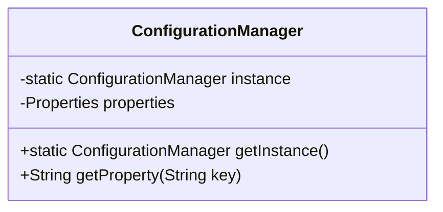

## 8.1.1 Recognizing When to Use Design Patterns in Java

Design patterns are powerful tools in a developer's toolkit, offering tried-and-true solutions to common design problems. However, recognizing when to use these patterns is crucial to avoid unnecessary complexity and ensure that they add value to your software design. This section explores the guidelines for identifying the appropriate situations to apply design patterns effectively in Java development.

### Understanding the Problem Domain

Before selecting a design pattern, it's essential to have a deep understanding of the problem domain. This involves comprehending the specific challenges and requirements of the project. Patterns are not one-size-fits-all solutions; they are context-specific. Therefore, understanding the nuances of the problem will guide you in choosing the right pattern that aligns with the project's needs.

### Solving Recurring Design Problems

Design patterns are particularly useful for solving recurring design problems. They provide a standardized approach to common issues, making your code more understandable and maintainable. When you encounter a problem that seems familiar or has been solved before in other projects, consider whether a design pattern can provide a robust solution.

### Adding Value vs. Simplicity

It's important to analyze whether a pattern adds value to the solution or if a simpler approach suffices. Over-engineering a solution by applying a pattern where it isn't necessary can lead to increased complexity and reduced readability. Always weigh the benefits of using a pattern against the simplicity of a straightforward implementation.

### Risks of Premature Pattern Application

Applying patterns prematurely, without fully grasping the requirements, can lead to inappropriate solutions. It's crucial to thoroughly understand the problem and its context before deciding on a pattern. Premature application can result in a design that is difficult to change or extend as the project evolves.

### Indicators for Pattern Applicability

Look for code smells or areas of high complexity as indicators for pattern applicability. Code smells such as duplicated code, large classes, or long methods can signal the need for a design pattern to improve structure and maintainability. Patterns can help refactor these areas into more manageable and understandable components.

### Future Scalability and Maintenance

When deciding to use a pattern, consider future scalability and maintenance. Patterns can provide a framework that supports growth and change, making it easier to adapt the codebase to new requirements. Evaluate whether the pattern will facilitate or hinder future development efforts.

### Comparing Multiple Patterns

In some cases, multiple patterns might seem applicable. It's advisable to compare these patterns to determine which best fits the specific context. Consider the trade-offs and benefits of each pattern, and choose the one that aligns with the project's goals and constraints.

### Start Simple and Refactor

A practical approach is to start with a straightforward implementation and refactor towards a pattern if needed. This allows you to keep the initial design simple and evolve it as the project requirements become clearer. Refactoring towards a pattern can improve the design without overcomplicating the initial implementation.

### Recognizing Common Scenarios

Recognizing common scenarios in the codebase can guide pattern selection. For example, if you frequently need to create objects with varying configurations, the Builder pattern might be appropriate. Identifying these scenarios can streamline the decision-making process for pattern application.

### Experience and Intuition

Experience and intuition play significant roles in identifying appropriate patterns. As you gain more experience with design patterns and software development, you'll develop an intuition for when a pattern is suitable. This intuition is honed through practice and learning from past projects.

### Seeking Feedback

When unsure about pattern application, seek feedback from peers or mentors. Collaborative discussions can provide new perspectives and insights, helping you make informed decisions. Peer reviews can also highlight potential pitfalls or alternative solutions you might not have considered.

### Successful Pattern Applications

Consider examples of situations where patterns successfully addressed design challenges. These case studies can provide valuable insights into how patterns can be effectively applied. Learning from real-world applications can enhance your understanding of pattern usage.

### Avoid Forcing Patterns

Avoid forcing a pattern into a solution where it doesn't naturally fit. Patterns should enhance the design, not complicate it. If a pattern feels like a forced fit, reconsider its applicability and explore other design strategies.

### Understanding Intent and Consequences

Before implementing a pattern, understand its intent and consequences. Each pattern has specific goals and trade-offs. Being aware of these aspects helps you anticipate the impact on your design and make informed decisions.

### Documenting Pattern Rationale

Document the rationale for choosing a pattern to aid future maintenance. Clear documentation helps other developers understand the design decisions and facilitates easier updates and modifications. It also serves as a reference for why a particular pattern was chosen.

### Staying Updated with Industry Trends

Stay updated with industry trends and case studies on pattern usage. The software development landscape is constantly evolving, and new patterns or variations may emerge. Keeping informed ensures that you are using the most effective and relevant patterns in your projects.

### Practical Java Code Example

Let's consider a practical example where the Singleton pattern is applied to manage a configuration manager in a Java application. This pattern ensures that only one instance of the configuration manager exists, providing a global access point.

```java
public class ConfigurationManager {
    private static ConfigurationManager instance;
    private Properties properties;

    private ConfigurationManager() {
        // Load configuration properties
        properties = new Properties();
        try (InputStream input = new FileInputStream("config.properties")) {
            properties.load(input);
        } catch (IOException ex) {
            ex.printStackTrace();
        }
    }

    public static synchronized ConfigurationManager getInstance() {
        if (instance == null) {
            instance = new ConfigurationManager();
        }
        return instance;
    }

    public String getProperty(String key) {
        return properties.getProperty(key);
    }
}
```

In this example, the Singleton pattern is used to ensure that the `ConfigurationManager` is instantiated only once. This is useful when you need a centralized configuration manager that is accessed throughout the application.

### Diagram: Singleton Pattern

Below is a diagram illustrating the Singleton pattern:



### Conclusion

Recognizing when to use design patterns is a skill that combines understanding the problem domain, evaluating the benefits of patterns, and applying experience and intuition. By following these guidelines, you can effectively leverage design patterns to create robust, maintainable, and scalable Java applications.

## Quiz Time!



### What is the first step before selecting a design pattern?

- [x] Understanding the problem domain
- [ ] Writing the code
- [ ] Selecting a random pattern
- [ ] Consulting a design pattern book

> **Explanation:** Understanding the problem domain ensures that the pattern chosen is relevant and addresses the specific challenges of the project.

### Why should patterns be used?

- [x] To solve recurring design problems
- [ ] To make code more complex
- [ ] To replace all existing code
- [ ] To avoid writing any code

> **Explanation:** Patterns provide standardized solutions for recurring design problems, enhancing code maintainability and readability.

### What should be considered when deciding to use a pattern?

- [x] Future scalability and maintenance
- [ ] The color of the code editor
- [ ] The number of lines in the code
- [ ] The brand of the computer

> **Explanation:** Patterns should facilitate future scalability and maintenance, ensuring the codebase can adapt to new requirements.

### What is a risk of prematurely applying patterns?

- [x] Inappropriate solutions
- [ ] Faster development
- [ ] Reduced code complexity
- [ ] Increased code readability

> **Explanation:** Premature application can lead to solutions that don't fully address the problem, making future changes difficult.

### What can indicate the need for a design pattern?

- [x] Code smells or high complexity
- [ ] Perfectly working code
- [ ] A single line of code
- [ ] Simple algorithms

> **Explanation:** Code smells or areas of high complexity can signal the need for a design pattern to improve structure and maintainability.

### How can multiple applicable patterns be evaluated?

- [x] Comparing trade-offs and benefits
- [ ] Flipping a coin
- [ ] Asking a non-developer
- [ ] Ignoring the problem

> **Explanation:** Comparing trade-offs and benefits helps choose the pattern that best fits the specific context and project goals.

### What role does experience play in pattern recognition?

- [x] It helps develop intuition for suitable patterns
- [ ] It makes patterns unnecessary
- [ ] It complicates the decision-making process
- [ ] It eliminates the need for patterns

> **Explanation:** Experience helps develop an intuition for when a pattern is suitable, based on past projects and learning.

### What should be documented when choosing a pattern?

- [x] The rationale for choosing the pattern
- [ ] The weather on the day of coding
- [ ] The font used in the code editor
- [ ] The number of coffee cups consumed

> **Explanation:** Documenting the rationale helps future developers understand design decisions and facilitates easier updates.

### What is a practical approach to pattern application?

- [x] Start simple and refactor towards a pattern
- [ ] Apply all patterns immediately
- [ ] Avoid patterns at all costs
- [ ] Use patterns only in small projects

> **Explanation:** Starting simple allows for a straightforward design that can evolve into a pattern as requirements become clearer.

### True or False: Forcing a pattern into a solution is a good practice.

- [ ] True
- [x] False

> **Explanation:** Forcing a pattern can complicate the design unnecessarily. Patterns should enhance the design, not complicate it.


