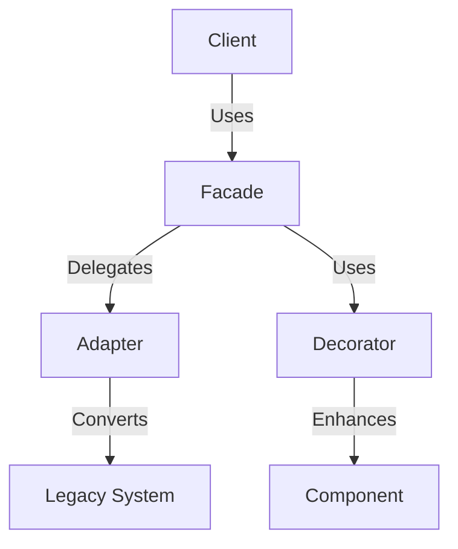

## 8.2.1 Overusing Design Patterns

Design patterns are invaluable tools in software development, providing proven solutions to common problems. However, like any tool, they must be used judiciously. Overusing design patterns—applying them where they are unnecessary or add no value—can lead to several issues, including code bloat, decreased performance, and increased complexity. In this section, we will explore the pitfalls of overusing design patterns and provide guidance on how to apply them effectively.

### Understanding Overuse of Design Patterns

Overuse of design patterns occurs when developers apply patterns indiscriminately, often without considering whether they truly address the problem at hand. This can happen for various reasons, such as a desire to demonstrate technical prowess or a misunderstanding of the pattern's intent. While design patterns can enhance code structure and readability, their misuse can lead to the opposite effect.

### Code Bloat and Decreased Performance

One of the primary consequences of overusing design patterns is code bloat. When patterns are applied unnecessarily, the codebase can become cluttered with excessive classes, interfaces, and abstractions. This not only increases the size of the code but can also degrade performance. Each additional layer of abstraction can introduce overhead, slowing down execution and complicating debugging.

Consider the Singleton pattern, which is often overused. While it ensures a class has only one instance, applying it to classes that do not require such a constraint can lead to unnecessary complexity and hinder testing due to tight coupling.

#### Example: Unnecessary Singleton

```java
public class ConfigurationManager {
    private static ConfigurationManager instance;

    private ConfigurationManager() {
        // Load configuration
    }

    public static ConfigurationManager getInstance() {
        if (instance == null) {
            instance = new ConfigurationManager();
        }
        return instance;
    }
}
```

In this example, the Singleton pattern is used for a configuration manager. However, if the application doesn't require a single point of access or the configuration is not shared globally, this pattern adds unnecessary complexity.

### Simpler Solutions vs. Patterns

Not every problem requires a design pattern. In many cases, simpler solutions are more effective. For instance, using a simple factory method might suffice instead of implementing a full-fledged Factory pattern, especially when the object creation logic is straightforward.

#### Example: Overusing Factory Pattern

```java
public class ShapeFactory {
    public static Shape createShape(String type) {
        switch (type) {
            case "circle":
                return new Circle();
            case "square":
                return new Square();
            default:
                throw new IllegalArgumentException("Unknown shape type");
        }
    }
}
```

If the application only needs to create a few types of shapes, a simple constructor call might be more appropriate than a factory method.

### Complexity and Maintainability

Excessive abstraction can make code harder to read and maintain. Stacking multiple patterns unnecessarily can obscure the core logic, making it difficult for developers to understand and modify the code. This complexity can also impact team productivity, as developers spend more time deciphering the code rather than implementing features.

#### Diagram: Complexity from Overusing Patterns



In this diagram, the client interacts with a facade, which uses both an adapter and a decorator. While each pattern has its place, using all three for a simple task can introduce unnecessary complexity.

### Evaluating the Cost-Benefit Ratio

Before implementing a design pattern, it's crucial to evaluate its cost-benefit ratio. Consider whether the pattern truly addresses the problem and if the benefits outweigh the added complexity. Avoid feeling compelled to use patterns solely to showcase technical skills. Instead, focus on solving the problem effectively.

### Avoiding Anti-Patterns

Overuse of design patterns can lead to anti-patterns, which are counterproductive solutions that negate the benefits of good design. For example, the "God Object" anti-pattern can emerge when the Singleton pattern is overused, resulting in a class that knows too much or does too much.

### Best Practices for Applying Design Patterns

1. **Code Reviews**: Regular code reviews can help catch instances where patterns may be overapplied. Encourage team members to provide feedback on the necessity and implementation of patterns.

2. **Keep It Simple, Stupid (KISS)**: Follow the KISS principle by keeping solutions as simple as possible. Avoid unnecessary complexity and focus on clarity.

3. **Understand the Intent**: Ensure you understand the intent of the pattern before applying it. This helps avoid misapplication and ensures the pattern is used appropriately.

4. **Learn from Experience**: Learn from experienced developers and reflect on past projects to improve pattern application. Continuous learning and adaptation are key to mastering design patterns.

5. **Focus on Problem Solving**: Prioritize solving the problem effectively over fitting in a pattern. Patterns should serve the solution, not dictate it.

### Conclusion

Design patterns are powerful tools in the hands of skilled developers, but their overuse can lead to more harm than good. By understanding the pitfalls of overusing design patterns and applying them judiciously, developers can create robust, maintainable, and efficient Java applications. Always evaluate the necessity of a pattern, keep solutions simple, and focus on solving the problem at hand.

## Quiz Time!



### What is a primary consequence of overusing design patterns?

- [x] Code bloat
- [ ] Improved performance
- [ ] Simplified code
- [ ] Reduced complexity

> **Explanation:** Overusing design patterns can lead to code bloat, where the codebase becomes cluttered with unnecessary classes and abstractions.

### Why might the Singleton pattern be overused?

- [x] It is often applied to classes that do not require a single instance.
- [ ] It always improves performance.
- [ ] It simplifies testing.
- [ ] It reduces coupling.

> **Explanation:** The Singleton pattern is often overused when applied to classes that do not need to enforce a single instance, adding unnecessary complexity.

### What is a potential downside of excessive abstraction?

- [x] Harder to read and maintain code
- [ ] Increased performance
- [ ] Easier debugging
- [ ] Simplified logic

> **Explanation:** Excessive abstraction can make code harder to read and maintain, as it obscures the core logic.

### What should developers focus on instead of fitting in a pattern?

- [x] Solving the problem effectively
- [ ] Demonstrating technical prowess
- [ ] Using as many patterns as possible
- [ ] Increasing code complexity

> **Explanation:** Developers should focus on solving the problem effectively rather than fitting in a pattern.

### How can code reviews help with design pattern application?

- [x] They can catch instances where patterns may be overapplied.
- [ ] They ensure patterns are always used.
- [ ] They eliminate the need for patterns.
- [ ] They increase code complexity.

> **Explanation:** Code reviews can help identify where patterns may be overapplied, ensuring they are used appropriately.

### What principle suggests keeping solutions as simple as possible?

- [x] KISS (Keep It Simple, Stupid)
- [ ] DRY (Don't Repeat Yourself)
- [ ] YAGNI (You Aren't Gonna Need It)
- [ ] SOLID

> **Explanation:** The KISS principle advocates for keeping solutions as simple as possible to avoid unnecessary complexity.

### What can excessive pattern use lead to?

- [x] Anti-patterns
- [ ] Improved code readability
- [ ] Simplified design
- [ ] Reduced code size

> **Explanation:** Excessive pattern use can lead to anti-patterns, which are counterproductive solutions.

### What should be evaluated before implementing a pattern?

- [x] Cost-benefit ratio
- [ ] Number of classes
- [ ] Number of patterns used
- [ ] Code length

> **Explanation:** Evaluating the cost-benefit ratio helps determine if the pattern's benefits outweigh its complexity.

### Why is understanding the intent of a pattern important?

- [x] To avoid misapplication
- [ ] To increase code length
- [ ] To use more patterns
- [ ] To reduce testing

> **Explanation:** Understanding the intent of a pattern helps avoid misapplication and ensures it is used appropriately.

### True or False: Every problem requires a design pattern.

- [ ] True
- [x] False

> **Explanation:** Not every problem requires a design pattern; sometimes, simpler solutions are more effective.


