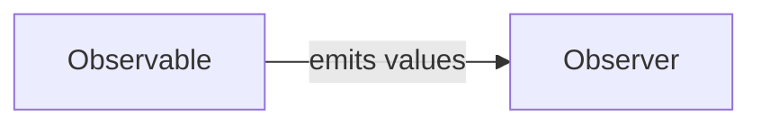

## 9.1.2 Observables and Observers

Reactive programming has revolutionized the way developers handle asynchronous data streams, offering a paradigm that is both powerful and intuitive. At the heart of reactive programming are two fundamental concepts: **Observables** and **Observers**. Understanding these concepts is crucial for leveraging the full potential of reactive programming in JavaScript and TypeScript.

### Understanding Observables

**Observables** are the cornerstone of reactive programming. They are data producers that emit values over time, allowing applications to react to new data as it becomes available. Unlike traditional data structures, Observables are designed to handle asynchronous data streams, making them ideal for scenarios such as user interactions, network requests, or any event-driven data flow.

#### Key Characteristics of Observables

- **Asynchronous Data Streams**: Observables can emit data asynchronously, meaning they can produce data at any time, without blocking the execution of the program.
- **Multiple Values**: Unlike Promises, which resolve to a single value, Observables can emit multiple values over time.
- **Lazy Evaluation**: Observables do not produce values until there is a subscription, making them efficient in terms of resource usage.

### Understanding Observers

**Observers** are consumers that subscribe to Observables to receive emitted values. An Observer is essentially an object that defines how to handle the data, errors, and completion signals from an Observable.

#### The Role of Callbacks in Observers

Observers utilize three main callbacks to handle data from Observables:

- **`next`**: This callback is invoked each time the Observable emits a value.
- **`error`**: This callback is called if the Observable encounters an error.
- **`complete`**: This callback is executed when the Observable has finished emitting all its values.

These callbacks allow Observers to react appropriately to the data stream, handle errors gracefully, and perform cleanup operations once data emission is complete.

### Creating Observables

Creating Observables in JavaScript and TypeScript can be done using various methods, depending on the data source. Let's explore some common ways to create Observables:

#### Creating Observables from Arrays

Arrays are a simple and common data source for Observables. Using RxJS, you can easily convert an array into an Observable using the `from` operator:

```typescript
import { from } from 'rxjs';

const array = [1, 2, 3, 4, 5];
const observableFromArray = from(array);

observableFromArray.subscribe({
  next: value => console.log(`Received value: ${value}`),
  error: err => console.error(`Error occurred: ${err}`),
  complete: () => console.log('Observable completed')
});
```

#### Creating Observables from Events

Observables can also be created from DOM events, allowing you to react to user interactions:

```typescript
import { fromEvent } from 'rxjs';

const button = document.querySelector('button');
const clicks = fromEvent(button, 'click');

clicks.subscribe({
  next: event => console.log('Button clicked!', event),
  error: err => console.error(`Error occurred: ${err}`),
  complete: () => console.log('Observable completed')
});
```

#### Creating Observables from Timers

For time-based operations, the `interval` operator can be used to create an Observable that emits values at specified intervals:

```typescript
import { interval } from 'rxjs';

const timerObservable = interval(1000);

timerObservable.subscribe({
  next: value => console.log(`Timer tick: ${value}`),
  error: err => console.error(`Error occurred: ${err}`),
  complete: () => console.log('Observable completed')
});
```

### Observables vs. Promises

While both Observables and Promises handle asynchronous operations, they have distinct differences:

- **Multiple Values**: Observables can emit multiple values over time, while Promises resolve to a single value.
- **Lazy Evaluation**: Observables are lazy; they do not produce values until subscribed to, whereas Promises are eager and execute immediately upon creation.
- **Cancellation**: Observables can be unsubscribed from, effectively canceling the data stream, while Promises cannot be canceled once initiated.

### Lazy Evaluation and Subscriptions

Lazy evaluation is a defining feature of Observables. An Observable does not produce values until an Observer subscribes to it. This behavior ensures that resources are only used when necessary, optimizing performance.

#### Subscribing to Observables

Subscribing to an Observable is straightforward, but managing subscriptions is crucial to avoid memory leaks:

```typescript
import { of } from 'rxjs';

const numbers = of(1, 2, 3);
const subscription = numbers.subscribe({
  next: value => console.log(`Received: ${value}`),
  error: err => console.error(`Error: ${err}`),
  complete: () => console.log('Completed')
});

// Unsubscribe to prevent memory leaks
subscription.unsubscribe();
```

### Cold vs. Hot Observables

Observables can be classified into two types: **Cold** and **Hot**.

- **Cold Observables**: These Observables start emitting values only when an Observer subscribes. Each subscription receives its own independent execution.
- **Hot Observables**: These Observables emit values regardless of subscriptions. Multiple Observers share the same execution and receive the same values.

Understanding the difference between cold and hot Observables is essential for designing efficient reactive systems.

### Visualizing Observables and Observers

To better understand the interaction between Observables and Observers, consider the following diagram:



This diagram illustrates how an Observable emits values that are consumed by an Observer.

### Unsubscribing from Observables

Unsubscribing from Observables is crucial to prevent resource leaks. Failing to unsubscribe can lead to memory leaks and unexpected behavior in applications. Always ensure that subscriptions are properly managed and terminated when no longer needed.

### Using Built-in Creation Functions

RxJS provides several built-in functions to create Observables efficiently:

- **`of`**: Creates an Observable from a sequence of values.
- **`from`**: Converts various data structures, such as arrays or Promises, into Observables.
- **`interval`**: Creates an Observable that emits values at specified intervals.

### Creating Custom Observables

For more complex scenarios, you can create custom Observables using the `Observable` constructor:

```typescript
import { Observable } from 'rxjs';

const customObservable = new Observable<number>(subscriber => {
  subscriber.next(1);
  subscriber.next(2);
  subscriber.next(3);
  subscriber.complete();
});

customObservable.subscribe({
  next: value => console.log(`Custom Observable: ${value}`),
  error: err => console.error(`Error: ${err}`),
  complete: () => console.log('Completed')
});
```

### Error Handling in Observables

Observables provide robust error handling mechanisms. Errors are propagated to the `error` callback of the Observer, allowing for graceful handling and recovery:

```typescript
import { throwError } from 'rxjs';

const errorObservable = throwError('An error occurred');

errorObservable.subscribe({
  next: value => console.log(`Value: ${value}`),
  error: err => console.error(`Caught error: ${err}`),
  complete: () => console.log('Completed')
});
```

### Best Practices and Common Pitfalls

- **Naming Conventions**: Use descriptive names for Observables and Observers to enhance code readability.
- **Avoid Multiple Subscriptions**: Be cautious of subscribing multiple times unintentionally, as it can lead to redundant operations and resource wastage.
- **Memory Management**: Always unsubscribe from Observables to prevent memory leaks, especially in long-lived applications.

### Encouragement for Practice

To master Observables and Observers, practice creating and subscribing to Observables from various data sources. Experiment with different scenarios and explore the rich set of operators provided by RxJS.

### Conclusion

Observables and Observers are fundamental to reactive programming, offering a powerful model for handling asynchronous data streams. By understanding their roles, creation, and management, you can build efficient, responsive applications in JavaScript and TypeScript. As you continue to explore reactive programming, consider the best practices and common pitfalls discussed here to enhance your development skills.

## Quiz Time!



### What is an Observable in reactive programming?

- [x] A data producer that emits values over time
- [ ] A data consumer that receives values
- [ ] A synchronous data structure
- [ ] A function that handles errors

> **Explanation:** An Observable is a data producer in reactive programming that emits values over time, allowing applications to react to new data as it becomes available.

### What is the role of an Observer in reactive programming?

- [ ] To produce data
- [x] To consume and react to emitted values
- [ ] To create Observables
- [ ] To handle synchronous operations

> **Explanation:** An Observer is a consumer in reactive programming that subscribes to an Observable to receive and react to the emitted values.

### Which callback in an Observer handles emitted values?

- [ ] error
- [x] next
- [ ] complete
- [ ] subscribe

> **Explanation:** The `next` callback in an Observer is invoked each time the Observable emits a value, allowing the Observer to process the data.

### How do Observables differ from Promises?

- [ ] Observables emit a single value
- [x] Observables can emit multiple values over time
- [ ] Promises are lazy
- [ ] Observables are eager

> **Explanation:** Observables can emit multiple values over time, whereas Promises resolve to a single value.

### What is lazy evaluation in Observables?

- [ ] Observables produce values immediately
- [x] Observables produce values only when subscribed to
- [ ] Observables do not emit values
- [ ] Observables are always active

> **Explanation:** Lazy evaluation means that Observables do not produce values until an Observer subscribes to them, optimizing resource usage.

### Why is unsubscribing from Observables important?

- [ ] To emit more values
- [ ] To handle errors
- [x] To prevent memory leaks
- [ ] To complete the Observable

> **Explanation:** Unsubscribing from Observables is crucial to prevent memory leaks and ensure that resources are released when no longer needed.

### What is a cold Observable?

- [x] An Observable that starts emitting values when subscribed to
- [ ] An Observable that emits values regardless of subscriptions
- [ ] An Observable that never emits values
- [ ] An Observable that handles errors

> **Explanation:** A cold Observable starts emitting values only when an Observer subscribes to it, providing each subscription with its own independent execution.

### Which RxJS function creates an Observable from an array?

- [ ] of
- [x] from
- [ ] interval
- [ ] throwError

> **Explanation:** The `from` function in RxJS converts arrays and other data structures into Observables.

### How are errors propagated in Observables?

- [ ] Through the next callback
- [x] Through the error callback
- [ ] Through the complete callback
- [ ] Through the subscribe method

> **Explanation:** Errors in Observables are propagated to the `error` callback of the Observer, allowing for error handling and recovery.

### Observables are a key concept in which programming paradigm?

- [ ] Object-Oriented Programming
- [ ] Functional Programming
- [x] Reactive Programming
- [ ] Procedural Programming

> **Explanation:** Observables are a fundamental concept in reactive programming, enabling the handling of asynchronous data streams.


