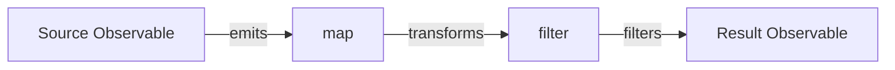

---

linkTitle: "9.1.3 Operators and Transformations"
title: "Mastering Operators and Transformations in Reactive Programming"
description: "Explore the power of operators in Reactive Programming with JavaScript and TypeScript. Learn how to transform data streams, manage concurrency, and handle errors using RxJS operators."
categories:
- Reactive Programming
- JavaScript
- TypeScript
tags:
- RxJS
- Operators
- Data Transformation
- Observables
- Concurrency
date: 2024-10-25
type: docs
nav_weight: 9130

---

## 9.1.3 Operators and Transformations

In the realm of reactive programming, operators are the cornerstone of transforming and manipulating data streams. They are the functions that allow developers to shape the data emitted by Observables, making them a powerful tool for crafting complex data flow logic. This section delves into the intricacies of operators in reactive programming, particularly within the context of JavaScript and TypeScript using RxJS.

### Understanding Operators in Reactive Programming

Operators in reactive programming are akin to the operations you perform on arrays or collections in functional programming. They enable you to transform, filter, combine, and manage data streams. Operators are essential for creating efficient, readable, and maintainable reactive code.

#### Pipeable Operators vs. Creation Operators

Operators in RxJS are broadly categorized into two types: **pipeable operators** and **creation operators**.

- **Pipeable Operators**: These operators are functions that take an Observable as input and return a new Observable. They are used within the `pipe` method to create a chain of operations. Examples include `map`, `filter`, and `mergeMap`.

- **Creation Operators**: These operators are used to create new Observables. They are standalone functions that generate Observables from various sources, such as arrays, events, or promises. Examples include `of`, `from`, and `interval`.

Understanding the distinction between these two types of operators is crucial for effectively using RxJS to manage data streams.

### Using the `pipe` Method for Clean Code

The `pipe` method is a vital feature in RxJS that allows you to chain multiple pipeable operators together. This method enhances code readability and maintainability by providing a clean, declarative way to describe data transformations.

Here's a simple example of using the `pipe` method with some common operators:

```typescript
import { of } from 'rxjs';
import { map, filter } from 'rxjs/operators';

const numbers$ = of(1, 2, 3, 4, 5);

const transformed$ = numbers$.pipe(
  map(n => n * 2),
  filter(n => n > 5)
);

transformed$.subscribe(console.log); // Output: 6, 8, 10
```

In this example, the `map` operator doubles each number, and the `filter` operator allows only numbers greater than 5 to pass through.

### Common Operators and Their Applications

#### 1. **Map Operator**

The `map` operator is used to transform each value emitted by an Observable by applying a function to it.

```typescript
import { of } from 'rxjs';
import { map } from 'rxjs/operators';

of(1, 2, 3).pipe(
  map(x => x * 10)
).subscribe(console.log); // Output: 10, 20, 30
```

#### 2. **Filter Operator**

The `filter` operator emits only those values from the source Observable that satisfy a specified predicate.

```typescript
import { of } from 'rxjs';
import { filter } from 'rxjs/operators';

of(1, 2, 3, 4, 5).pipe(
  filter(x => x % 2 === 0)
).subscribe(console.log); // Output: 2, 4
```

#### 3. **Reduce Operator**

The `reduce` operator applies an accumulator function over the source Observable, returning the accumulated result when the source completes.

```typescript
import { of } from 'rxjs';
import { reduce } from 'rxjs/operators';

of(1, 2, 3, 4).pipe(
  reduce((acc, value) => acc + value, 0)
).subscribe(console.log); // Output: 10
```

#### 4. **Scan Operator**

Similar to `reduce`, the `scan` operator applies an accumulator function over the source Observable, but it emits the accumulated result after each value is emitted.

```typescript
import { of } from 'rxjs';
import { scan } from 'rxjs/operators';

of(1, 2, 3, 4).pipe(
  scan((acc, value) => acc + value, 0)
).subscribe(console.log); // Output: 1, 3, 6, 10
```

#### 5. **MergeMap Operator**

The `mergeMap` operator is used to map each value to an Observable, then flatten all of these inner Observables using `mergeAll`.

```typescript
import { of } from 'rxjs';
import { mergeMap } from 'rxjs/operators';

of('a', 'b', 'c').pipe(
  mergeMap(char => of(char + '1', char + '2'))
).subscribe(console.log); // Output: a1, a2, b1, b2, c1, c2
```

### Transforming Data Streams with Operators

Operators allow you to build powerful data pipelines by transforming data streams effectively. They enable you to compose complex operations in a clean and declarative manner.

#### Chaining Operators

Chaining operators using the `pipe` method allows you to create a sequence of transformations. This approach leads to more readable and maintainable code.

```typescript
import { from } from 'rxjs';
import { map, filter, reduce } from 'rxjs/operators';

const numbers$ = from([1, 2, 3, 4, 5, 6]);

const result$ = numbers$.pipe(
  filter(n => n % 2 === 0),
  map(n => n * n),
  reduce((acc, n) => acc + n, 0)
);

result$.subscribe(console.log); // Output: 56 (2^2 + 4^2 + 6^2)
```

In this example, the data stream is filtered to include only even numbers, each number is squared, and the results are summed.

### Managing Timing, Concurrency, and Error Handling

Operators can also manage timing, concurrency, and error handling, making them indispensable for complex data flows.

#### Timing and Concurrency

Operators like `debounceTime`, `throttleTime`, and `switchMap` help manage timing and concurrency in data streams.

- **DebounceTime**: Delays emissions from the source Observable by a specified time span, allowing only the last value to be emitted.

```typescript
import { fromEvent } from 'rxjs';
import { debounceTime, map } from 'rxjs/operators';

const clicks$ = fromEvent(document, 'click');

clicks$.pipe(
  debounceTime(300),
  map(event => event.clientX)
).subscribe(console.log);
```

- **SwitchMap**: Maps each value to an Observable, then flattens all of these inner Observables using `switch`.

```typescript
import { of } from 'rxjs';
import { switchMap } from 'rxjs/operators';

of(1, 2, 3).pipe(
  switchMap(n => of(n * 10))
).subscribe(console.log); // Output: 10, 20, 30
```

#### Error Handling

Operators like `catchError` and `retry` provide robust mechanisms for error handling in reactive streams.

- **CatchError**: Catches errors on the source Observable and returns a new Observable or throws an error.

```typescript
import { of, throwError } from 'rxjs';
import { catchError } from 'rxjs/operators';

throwError('Error!').pipe(
  catchError(err => of('Recovered from error'))
).subscribe(console.log); // Output: Recovered from error
```

### The Importance of Operator Ordering

The order in which operators are applied can significantly impact the behavior of the data stream. For instance, placing a `filter` operator before a `map` can reduce the number of transformations, potentially improving performance.

### Choosing the Right Operators

Selecting the appropriate operators depends on the specific requirements of your application. Consider factors such as:

- **Data Transformation**: Use `map`, `scan`, or `reduce` for transforming data.
- **Filtering**: Employ `filter` to selectively emit values.
- **Combining Streams**: Use `mergeMap`, `concatMap`, or `switchMap` for combining multiple streams.
- **Error Handling**: Leverage `catchError` and `retry` for managing errors.

### Higher-Order Observables

Higher-order Observables are Observables that emit other Observables. Operators like `mergeMap`, `concatMap`, and `switchMap` are designed to work with higher-order Observables, allowing you to flatten and manage these complex structures.

### Visualizing Data Transformation with Mermaid.js

Below is a Mermaid.js diagram illustrating how operators transform data within a pipeline:



This diagram represents a simple pipeline where a source Observable emits values that are transformed by a `map` operator and then filtered by a `filter` operator, resulting in a final Observable.

### Best Practices for Managing Complexity

When working with multiple operators, it's essential to manage complexity effectively:

- **Use the `pipe` Method**: Chain operators using `pipe` for clarity and readability.
- **Break Down Complex Pipelines**: Split complex pipelines into smaller, reusable functions.
- **Comment Your Code**: Provide comments to explain the purpose of each operator in the pipeline.

### Performance Considerations

While operators are powerful, they can introduce performance overhead if not used judiciously. Consider the following tips:

- **Minimize Operator Usage**: Use only the necessary operators to achieve your goals.
- **Optimize Operator Order**: Place operators like `filter` early in the pipeline to reduce data processing.
- **Avoid Unnecessary Subscriptions**: Use operators that manage subscriptions efficiently.

### Handling Asynchronous Data and Concurrency

Operators can handle asynchronous data and concurrency issues effectively. For example, `mergeMap` can handle multiple concurrent inner Observables, while `switchMap` cancels previous inner Observables when a new one is emitted.

### Debugging Operator Chains

Debugging reactive streams can be challenging. Use the following tips to understand and resolve issues:

- **Use Debugging Operators**: Operators like `tap` can help inspect values at various stages of the pipeline.
- **Leverage Logging**: Add logging within operators to trace data flow and identify issues.
- **Understand Error Messages**: Familiarize yourself with common error messages and their meanings.

### Experimenting with Operators

To master operators, it's crucial to experiment and become familiar with their behaviors. Try different combinations and observe their effects on data streams. This hands-on approach will deepen your understanding and improve your reactive programming skills.

### Conclusion

Operators are the backbone of reactive programming, providing the tools necessary to transform, filter, and manage data streams effectively. By understanding how to use operators like `map`, `filter`, `mergeMap`, and others, you can build powerful and efficient reactive applications. Remember to consider performance, error handling, and concurrency when designing your data pipelines. Experiment with different operators and configurations to become proficient in crafting complex reactive systems.

## Quiz Time!



### What are operators in reactive programming?

- [x] Functions that transform and manipulate data streams
- [ ] Methods to create Observables
- [ ] Functions to handle errors in Observables
- [ ] Static methods for managing subscriptions

> **Explanation:** Operators are functions that allow you to transform and manipulate data streams emitted by Observables.

### Which method is used to chain multiple operators in RxJS?

- [x] pipe
- [ ] chain
- [ ] link
- [ ] connect

> **Explanation:** The `pipe` method is used to chain multiple operators together in RxJS.

### What is the main difference between pipeable and creation operators?

- [x] Pipeable operators are used within the `pipe` method, while creation operators create Observables.
- [ ] Pipeable operators create Observables, while creation operators are used within the `pipe` method.
- [ ] Both are used to create Observables.
- [ ] Both are used within the `pipe` method.

> **Explanation:** Pipeable operators are used within the `pipe` method to transform data, whereas creation operators are used to create new Observables.

### Which operator would you use to transform each emitted value by multiplying it by 10?

- [x] map
- [ ] filter
- [ ] reduce
- [ ] mergeMap

> **Explanation:** The `map` operator is used to apply a function to each emitted value, transforming it.

### How does the `filter` operator work?

- [x] It emits values that satisfy a specified predicate.
- [ ] It transforms each value by applying a function.
- [ ] It combines multiple Observables into one.
- [ ] It handles errors in the data stream.

> **Explanation:** The `filter` operator emits only those values from the source Observable that satisfy a specified predicate.

### What is the purpose of the `reduce` operator?

- [x] To apply an accumulator function over the source Observable and return a single accumulated result.
- [ ] To transform each emitted value by applying a function.
- [ ] To emit values that satisfy a specified predicate.
- [ ] To manage concurrency in data streams.

> **Explanation:** The `reduce` operator applies an accumulator function over the source Observable, returning the accumulated result when the source completes.

### Which operator would you use to handle errors in an Observable?

- [x] catchError
- [ ] map
- [ ] filter
- [ ] mergeMap

> **Explanation:** The `catchError` operator is used to catch errors on the source Observable and return a new Observable or throw an error.

### What is a higher-order Observable?

- [x] An Observable that emits other Observables
- [ ] An Observable that emits primitive values
- [ ] An Observable that handles errors
- [ ] An Observable that manages concurrency

> **Explanation:** A higher-order Observable is an Observable that emits other Observables.

### Why is operator ordering important?

- [x] It can significantly impact the behavior and performance of the data stream.
- [ ] It determines the type of data emitted by the Observable.
- [ ] It affects the creation of Observables.
- [ ] It has no impact on the data stream.

> **Explanation:** The order in which operators are applied can significantly impact the behavior and performance of the data stream.

### True or False: The `switchMap` operator cancels previous inner Observables when a new one is emitted.

- [x] True
- [ ] False

> **Explanation:** The `switchMap` operator maps each value to an Observable, then flattens all of these inner Observables using `switch`, canceling previous inner Observables when a new one is emitted.


