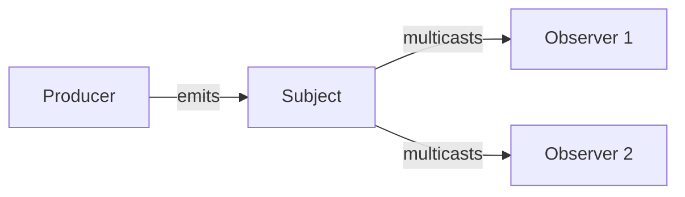

## 9.2.2 Creating and Subscribing to Observables in RxJS

Reactive programming has become a cornerstone in modern JavaScript and TypeScript development, offering powerful tools to handle asynchronous data streams. At the heart of this paradigm is the Observable, a fundamental concept in RxJS (Reactive Extensions for JavaScript). In this section, we will delve into the creation and subscription processes of Observables, explore various techniques and best practices, and provide detailed insights into managing data flows effectively.

### Understanding Observables

An Observable is a data structure that represents a collection of future values or events. Unlike promises, which handle a single asynchronous event, Observables can emit multiple values over time. This makes them particularly useful for scenarios such as handling user interactions, data streams, or any asynchronous operations.

### Creating Observables

RxJS provides a variety of functions to create Observables. Let's explore some of the most commonly used creation functions.

#### Using `of`

The `of` function creates an Observable from a sequence of values. It's a straightforward way to emit a finite set of values.

```javascript
import { of } from 'rxjs';

const observable = of(1, 2, 3, 4, 5);
observable.subscribe(value => console.log(value));
```

In this example, the Observable emits the numbers 1 to 5 sequentially.

#### Using `from`

The `from` function converts various data structures, such as arrays or promises, into Observables.

```javascript
import { from } from 'rxjs';

const arrayObservable = from([10, 20, 30]);
arrayObservable.subscribe(value => console.log(value));

const promiseObservable = from(fetch('https://api.example.com/data'));
promiseObservable.subscribe(response => console.log(response));
```

Here, `from` is used to create Observables from an array and a promise, respectively.

#### Using `create`

The `create` function allows for more customized Observable creation by providing a function that defines how the Observable should emit values.

```javascript
import { Observable } from 'rxjs';

const customObservable = new Observable(subscriber => {
  subscriber.next('Hello');
  subscriber.next('World');
  subscriber.complete();
});

customObservable.subscribe({
  next: value => console.log(value),
  complete: () => console.log('Completed')
});
```

This example demonstrates creating a custom Observable that emits two strings and then completes.

#### Using `interval`

The `interval` function creates an Observable that emits sequential numbers at specified intervals.

```javascript
import { interval } from 'rxjs';

const intervalObservable = interval(1000);
const subscription = intervalObservable.subscribe(value => console.log(value));

// To stop the interval after 5 seconds
setTimeout(() => subscription.unsubscribe(), 5000);
```

The Observable emits increasing numbers every second. The subscription is manually unsubscribed after 5 seconds to prevent it from running indefinitely.

#### Using `fromEvent`

The `fromEvent` function creates an Observable from DOM events, making it ideal for handling user interactions.

```javascript
import { fromEvent } from 'rxjs';

const button = document.querySelector('button');
const clickObservable = fromEvent(button, 'click');
clickObservable.subscribe(() => console.log('Button clicked'));
```

This example creates an Observable that listens for click events on a button.

### Converting Existing Data Structures to Observables

One of the strengths of RxJS is its ability to convert existing data structures into Observables, allowing seamless integration with existing codebases.

- **Arrays:** Use `from` to convert arrays into Observables.
- **Promises:** Convert promises using `from` to handle asynchronous operations.
- **Iterables:** Any iterable can be transformed into an Observable using `from`.

### Subscription Process

Subscribing to an Observable is how you start receiving data. Observers are objects that define how to handle emitted values, errors, and completion notifications.

```javascript
const observable = of(1, 2, 3);

const observer = {
  next: value => console.log('Received value:', value),
  error: err => console.error('Error:', err),
  complete: () => console.log('Complete')
};

observable.subscribe(observer);
```

In this example, the observer handles each emitted value, any potential errors, and the completion of the Observable.

### Managing Subscriptions

Properly managing subscriptions is crucial to prevent memory leaks. When an Observable is no longer needed, it's important to unsubscribe.

#### Using `unsubscribe`

The `unsubscribe` method stops the flow of data from an Observable to an Observer.

```javascript
const subscription = observable.subscribe(observer);
subscription.unsubscribe();
```

#### Using `Subscription` Objects

A `Subscription` represents a disposable resource, usually the execution of an Observable. Subscriptions can be combined using `add` and `remove` methods.

```javascript
const subscription1 = observable1.subscribe(observer1);
const subscription2 = observable2.subscribe(observer2);

const combinedSubscription = subscription1.add(subscription2);

// Unsubscribe from both
combinedSubscription.unsubscribe();
```

### Controlling Subscription Lifespan

RxJS provides operators to control how long a subscription should last, which is particularly useful for managing resources efficiently.

#### `take`

The `take` operator limits the number of emissions from an Observable.

```javascript
import { take } from 'rxjs/operators';

observable.pipe(take(3)).subscribe(observer);
```

This example will only allow the first three emissions.

#### `takeUntil`

The `takeUntil` operator stops the emission when another Observable emits a value.

```javascript
import { takeUntil } from 'rxjs/operators';

const stopObservable = fromEvent(button, 'click');
observable.pipe(takeUntil(stopObservable)).subscribe(observer);
```

Here, the emissions stop when the button is clicked.

#### `takeWhile`

The `takeWhile` operator continues emissions while a condition is true.

```javascript
import { takeWhile } from 'rxjs/operators';

observable.pipe(takeWhile(value => value < 10)).subscribe(observer);
```

This example will emit values while they are less than 10.

### Using Subjects

Subjects are a special type of Observable that act as both Observables and Observers. They are useful for multicasting to multiple Observers.

#### Basic Subject Usage

```javascript
import { Subject } from 'rxjs';

const subject = new Subject();

subject.subscribe(value => console.log('Observer A:', value));
subject.subscribe(value => console.log('Observer B:', value));

subject.next(1);
subject.next(2);
```

In this example, both observers receive the same values.

### Types of Subjects

#### `Subject`

A `Subject` is a multicast Observable that can emit values to multiple subscribers.

#### `BehaviorSubject`

A `BehaviorSubject` requires an initial value and emits the current value to new subscribers.

```javascript
import { BehaviorSubject } from 'rxjs';

const behaviorSubject = new BehaviorSubject(0);

behaviorSubject.subscribe(value => console.log('Observer A:', value));
behaviorSubject.next(1);
behaviorSubject.subscribe(value => console.log('Observer B:', value));
```

Observer B will immediately receive the last emitted value (1).

#### `ReplaySubject`

A `ReplaySubject` records multiple values and replays them to new subscribers.

```javascript
import { ReplaySubject } from 'rxjs';

const replaySubject = new ReplaySubject(2); // Buffer size of 2

replaySubject.next(1);
replaySubject.next(2);
replaySubject.next(3);

replaySubject.subscribe(value => console.log('Observer A:', value));
```

Observer A will receive the last two values (2 and 3).

#### `AsyncSubject`

An `AsyncSubject` emits the last value upon completion.

```javascript
import { AsyncSubject } from 'rxjs';

const asyncSubject = new AsyncSubject();

asyncSubject.subscribe(value => console.log('Observer A:', value));

asyncSubject.next(1);
asyncSubject.next(2);
asyncSubject.complete();
```

Observer A will only receive the last value (2) after completion.

### Data Flow in a Subject

Here's a visual representation of how data flows through a Subject:



### Best Practices for Using Subjects

- Use Subjects when you need to multicast to multiple Observers.
- Consider using `BehaviorSubject` or `ReplaySubject` when you need to retain the latest values for new subscribers.
- Avoid using Subjects as a default; prefer standard Observables unless multicasting is required.

### Error Handling

Handling errors gracefully is critical in reactive programming. Observables provide mechanisms to handle errors and recover from them.

```javascript
observable.subscribe({
  next: value => console.log(value),
  error: err => console.error('Error occurred:', err),
  complete: () => console.log('Complete')
});
```

### Composing Observables

RxJS operators allow you to compose Observables to create complex data flows. Operators like `map`, `filter`, `merge`, and `concat` can transform and combine data streams.

```javascript
import { map, filter } from 'rxjs/operators';

observable.pipe(
  filter(value => value % 2 === 0),
  map(value => value * 2)
).subscribe(observer);
```

### Common Pitfalls and Solutions

- **Nested Subscriptions:** Avoid nesting subscriptions. Use higher-order mapping operators like `mergeMap` or `switchMap`.
- **Memory Leaks:** Always manage subscriptions, especially in long-lived applications.
- **Error Handling:** Ensure that you have error handling logic in place to prevent application crashes.

### Conclusion

Creating and subscribing to Observables in RxJS is a powerful way to handle asynchronous data streams in JavaScript and TypeScript. By understanding the various creation functions, managing subscriptions effectively, and leveraging Subjects for multicasting, you can build robust and efficient reactive applications. Remember to handle errors gracefully and use operators to compose complex data flows. Practice these concepts to deepen your understanding and apply them to your projects.

## Quiz Time!



### What function would you use to create an Observable from an array?

- [ ] of
- [x] from
- [ ] interval
- [ ] create

> **Explanation:** The `from` function is used to convert arrays and other iterable data structures into Observables.

### Which operator would you use to limit the number of emissions from an Observable?

- [ ] map
- [ ] filter
- [x] take
- [ ] merge

> **Explanation:** The `take` operator limits the number of emissions from an Observable.

### What is the main difference between a Subject and a BehaviorSubject?

- [x] A BehaviorSubject requires an initial value and emits the current value to new subscribers.
- [ ] A Subject requires an initial value.
- [ ] A BehaviorSubject can only emit a single value.
- [ ] A Subject retains the last emitted value for new subscribers.

> **Explanation:** A `BehaviorSubject` requires an initial value and emits the current value to new subscribers, unlike a `Subject`.

### What method is used to stop receiving data from an Observable?

- [ ] complete
- [x] unsubscribe
- [ ] disconnect
- [ ] stop

> **Explanation:** The `unsubscribe` method is used to stop receiving data from an Observable.

### Which operator would you use to stop emissions based on another Observable's emission?

- [ ] take
- [x] takeUntil
- [ ] filter
- [ ] map

> **Explanation:** The `takeUntil` operator stops emissions when another Observable emits a value.

### What is the purpose of the `next` method in an Observer?

- [x] To handle each emitted value
- [ ] To handle errors
- [ ] To complete the Observable
- [ ] To unsubscribe from the Observable

> **Explanation:** The `next` method in an Observer is used to handle each emitted value from an Observable.

### Which Subject type emits the last value upon completion?

- [ ] Subject
- [ ] BehaviorSubject
- [ ] ReplaySubject
- [x] AsyncSubject

> **Explanation:** An `AsyncSubject` emits the last value upon completion.

### What is a common pitfall when using Observables?

- [x] Nested subscriptions
- [ ] Using Subjects
- [ ] Using `of` to create Observables
- [ ] Handling errors

> **Explanation:** Nested subscriptions are a common pitfall that can lead to complex and difficult-to-maintain code.

### What is the purpose of the `complete` method in an Observer?

- [ ] To handle each emitted value
- [ ] To handle errors
- [x] To signal that the Observable has completed
- [ ] To unsubscribe from the Observable

> **Explanation:** The `complete` method signals that the Observable has finished emitting values.

### True or False: A `ReplaySubject` can replay all previously emitted values to new subscribers.

- [x] True
- [ ] False

> **Explanation:** A `ReplaySubject` can replay all or a specified number of previously emitted values to new subscribers.


