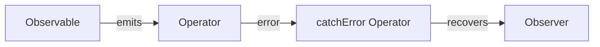

---

linkTitle: "9.2.4 Error Handling and Resource Management in RxJS"
title: "Error Handling and Resource Management in RxJS: Mastering Robustness and Efficiency"
description: "Explore robust error handling and resource management in RxJS to build resilient reactive applications. Learn about error propagation, handling operators, and best practices for managing subscriptions and resources."
categories:
- Reactive Programming
- JavaScript
- TypeScript
tags:
- RxJS
- Error Handling
- Resource Management
- Observables
- Programming Patterns
date: 2024-10-25
type: docs
nav_weight: 9240

---

## 9.2.4 Error Handling and Resource Management in RxJS

In the realm of reactive programming, especially when utilizing RxJS, robust error handling and effective resource management are critical components. This section delves into these aspects, providing a comprehensive understanding of how to manage errors and resources efficiently in RxJS.

### The Importance of Robust Error Handling in Reactive Programming

Error handling in reactive programming is crucial due to the asynchronous and dynamic nature of data streams. Unlike traditional imperative programming, where errors can be managed using try-catch blocks, reactive programming requires a more sophisticated approach to ensure that errors are propagated and handled gracefully without disrupting the entire data flow.

Errors in reactive systems can originate from various sources, such as network failures, invalid data, or unexpected conditions. If not handled properly, these errors can lead to application crashes, unresponsive interfaces, or data inconsistencies. Therefore, implementing robust error handling mechanisms is essential to maintain application stability and provide a seamless user experience.

### Error Propagation Through Observables

In RxJS, errors propagate through Observables in a manner similar to data emissions. When an error occurs, it interrupts the data stream, and the Observable stops emitting further values. The error is then sent to the Observer's error callback, allowing the application to respond appropriately.

Here's a basic example of how an error propagates through an Observable:

```javascript
import { of, throwError } from 'rxjs';
import { map, catchError } from 'rxjs/operators';

const source$ = of(1, 2, 3, 4).pipe(
  map(value => {
    if (value === 3) {
      throw new Error('An error occurred!');
    }
    return value;
  })
);

source$.subscribe({
  next: value => console.log('Value:', value),
  error: err => console.error('Error:', err.message),
  complete: () => console.log('Completed')
});
```

In this example, when the value `3` is encountered, an error is thrown, and the error callback logs the error message. The stream is terminated, and no further values are emitted.

### Error Handling Operators in RxJS

RxJS provides several operators to handle errors gracefully, allowing developers to recover from errors and continue processing data streams. Some of the most commonly used error handling operators include:

- **`catchError`**: Catches errors on the source Observable and returns a new Observable or throws an error.
- **`retry`**: Resubscribes to the source Observable a specified number of times upon encountering an error.
- **`retryWhen`**: Provides a more flexible retry mechanism, allowing custom logic to determine when to retry.
- **`onErrorResumeNext`**: Continues with the next Observable sequence in case of an error.

#### Using `catchError`

The `catchError` operator allows you to handle errors by providing a fallback Observable or performing additional logic. Here's an example:

```javascript
import { of, throwError } from 'rxjs';
import { catchError } from 'rxjs/operators';

const source$ = throwError('Something went wrong!').pipe(
  catchError(err => {
    console.error('Caught error:', err);
    return of('Recovered from error');
  })
);

source$.subscribe({
  next: value => console.log('Value:', value),
  complete: () => console.log('Completed')
});
```

In this example, when an error occurs, `catchError` catches it, logs the error, and returns a fallback Observable, allowing the stream to continue.

#### Using `retry` and `retryWhen`

The `retry` operator automatically resubscribes to the source Observable upon an error, while `retryWhen` provides more control over the retry logic:

```javascript
import { of, throwError, interval } from 'rxjs';
import { retry, retryWhen, delay, take } from 'rxjs/operators';

const source$ = throwError('Error!').pipe(
  retry(3) // Retry up to 3 times
);

source$.subscribe({
  next: value => console.log('Value:', value),
  error: err => console.error('Error after retries:', err),
  complete: () => console.log('Completed')
});

// Using retryWhen
const sourceWithRetryWhen$ = throwError('Error!').pipe(
  retryWhen(errors =>
    errors.pipe(
      delay(1000), // Wait 1 second before retrying
      take(3) // Retry up to 3 times
    )
  )
);

sourceWithRetryWhen$.subscribe({
  next: value => console.log('Value:', value),
  error: err => console.error('Error after retries:', err),
  complete: () => console.log('Completed')
});
```

#### Using `onErrorResumeNext`

The `onErrorResumeNext` operator allows the stream to continue with the next Observable sequence when an error occurs:

```javascript
import { of, throwError } from 'rxjs';
import { onErrorResumeNext } from 'rxjs/operators';

const source$ = throwError('Error!').pipe(
  onErrorResumeNext(of('Continuing after error'))
);

source$.subscribe({
  next: value => console.log('Value:', value),
  complete: () => console.log('Completed')
});
```

### Strategies for Logging Errors and Notifying Users

Effective error logging and user notification are essential for debugging and maintaining a positive user experience. Consider the following strategies:

- **Centralized Error Logging**: Implement a centralized logging mechanism to capture and store error details. This can be achieved using logging libraries or external services like Sentry or Loggly.
- **User Notifications**: Provide meaningful error messages to users, avoiding technical jargon. Use notification libraries or custom UI components to display error messages.
- **Error Context**: Include contextual information in error logs to facilitate debugging. This may include user actions, application state, or network conditions at the time of the error.

### Resource Management in RxJS

Resource management is a critical aspect of reactive programming, particularly in managing subscriptions and avoiding memory leaks. Proper cleanup of resources ensures that applications remain performant and do not consume unnecessary memory.

#### Cleaning Up Subscriptions

Subscriptions in RxJS need to be managed carefully to prevent memory leaks. When an Observable is no longer needed, it is essential to unsubscribe from it. Here are some best practices:

- **Use the `Subscription` Object**: Store subscriptions in a `Subscription` object and call `unsubscribe` when the Observable is no longer needed.
- **Utilize `add` Method**: The `Subscription` object provides an `add` method to manage multiple subscriptions together.
- **Automatic Unsubscription**: Use operators like `takeUntil` to automatically unsubscribe when a certain condition is met.

```javascript
import { interval, Subscription } from 'rxjs';
import { take } from 'rxjs/operators';

const subscription = new Subscription();

const source$ = interval(1000).pipe(take(5)); // Emit 5 values

const sub = source$.subscribe({
  next: value => console.log('Value:', value),
  complete: () => console.log('Completed')
});

subscription.add(sub);

// Later, when you want to clean up
subscription.unsubscribe();
```

#### Using `finalize` for Cleanup Actions

The `finalize` operator allows you to perform cleanup actions when an Observable completes or errors out:

```javascript
import { of } from 'rxjs';
import { finalize } from 'rxjs/operators';

const source$ = of(1, 2, 3).pipe(
  finalize(() => console.log('Cleanup actions performed'))
);

source$.subscribe({
  next: value => console.log('Value:', value),
  complete: () => console.log('Completed')
});
```

### Error Handling in Combined Observables and Complex Chains

Handling errors in complex Observable chains requires careful consideration. When combining Observables, errors can propagate through the entire chain, affecting all subsequent operations. To manage this:

- **Isolate Errors**: Use `catchError` at strategic points in the chain to isolate and handle errors without affecting unrelated streams.
- **Centralized Error Handling**: Implement centralized error handling logic to manage errors consistently across different parts of the application.

### Timeout Operators for Handling Hanging Observables

In some cases, Observables may hang indefinitely, causing the application to become unresponsive. Timeout operators can help manage these scenarios:

- **`timeout` Operator**: Emits an error if the Observable does not emit a value within a specified timeframe.

```javascript
import { of } from 'rxjs';
import { delay, timeout } from 'rxjs/operators';

const source$ = of('Hello').pipe(
  delay(3000), // Delays the emission by 3 seconds
  timeout(2000) // Throws an error if no emission within 2 seconds
);

source$.subscribe({
  next: value => console.log('Value:', value),
  error: err => console.error('Timeout error:', err),
  complete: () => console.log('Completed')
});
```

### Testing Error Scenarios

Testing error scenarios is vital to ensure that error handling logic is robust and effective. Consider the following testing strategies:

- **Unit Tests**: Write unit tests to simulate errors and verify that the application responds appropriately.
- **Integration Tests**: Test error handling in the context of the entire application to ensure that all components interact correctly.
- **Mocking Errors**: Use mocking libraries to simulate error conditions and test how the application handles them.

### Resource Management in Asynchronous Contexts

Managing resources in asynchronous contexts, such as WebSocket connections, requires careful planning:

- **Connection Management**: Ensure that connections are properly opened and closed. Use operators like `finalize` to close connections when no longer needed.
- **Resource Pooling**: Implement resource pooling techniques to reuse resources efficiently and reduce overhead.

### Best Practices for Error Handling and Resource Management

- **Consistent Error Handling**: Implement a consistent error handling strategy across the application to ensure that errors are managed uniformly.
- **Clear Error Messages**: Provide clear and concise error messages to facilitate debugging and improve user experience.
- **Regular Cleanup**: Regularly review and clean up resources to prevent memory leaks and ensure optimal performance.
- **Centralized Management**: Use centralized management patterns for both error handling and resource management to streamline application logic.

### Conclusion

Error handling and resource management are integral to building robust and efficient reactive applications with RxJS. By understanding how errors propagate, utilizing error handling operators, and implementing effective resource management strategies, developers can create applications that are resilient to failures and perform optimally.

The following Mermaid.js diagram illustrates error propagation and handling in an RxJS stream:



By applying the concepts and best practices discussed in this section, you can enhance the stability and reliability of your reactive applications, providing a seamless experience for users even in the face of unexpected challenges.

## Quiz Time!



### What is the primary purpose of error handling in reactive programming?

- [x] To ensure application stability and provide a seamless user experience
- [ ] To increase the speed of data processing
- [ ] To reduce the amount of code needed
- [ ] To automatically fix all errors

> **Explanation:** Error handling in reactive programming is crucial to maintaining application stability and ensuring a seamless user experience, especially given the asynchronous nature of data streams.

### How does the `catchError` operator function in RxJS?

- [x] It catches errors on the source Observable and returns a new Observable
- [ ] It retries the Observable a specified number of times
- [ ] It logs errors to the console
- [ ] It prevents the Observable from emitting any values

> **Explanation:** The `catchError` operator catches errors on the source Observable and allows you to return a new Observable, enabling error recovery and continuation of the data stream.

### Which operator would you use to automatically resubscribe to an Observable upon an error?

- [ ] catchError
- [x] retry
- [ ] finalize
- [ ] onErrorResumeNext

> **Explanation:** The `retry` operator automatically resubscribes to the source Observable a specified number of times upon encountering an error.

### What is the purpose of the `finalize` operator in RxJS?

- [ ] To catch errors and provide fallback values
- [x] To perform cleanup actions when an Observable completes or errors out
- [ ] To delay emissions from an Observable
- [ ] To combine multiple Observables into one

> **Explanation:** The `finalize` operator is used to perform cleanup actions when an Observable completes or errors out, ensuring resources are properly managed.

### In the context of RxJS, what is a common strategy for managing multiple subscriptions?

- [ ] Using the `map` operator
- [x] Using the `Subscription` object and its `add` method
- [ ] Using the `merge` operator
- [ ] Using the `filter` operator

> **Explanation:** The `Subscription` object and its `add` method allow you to manage multiple subscriptions together, making it easier to unsubscribe from all of them at once.

### How can you handle errors in combined Observables and complex chains effectively?

- [x] Use `catchError` at strategic points to isolate errors
- [ ] Avoid combining Observables
- [ ] Use `map` to transform errors into data
- [ ] Ignore errors and continue processing

> **Explanation:** Using `catchError` at strategic points in combined Observables and complex chains allows you to isolate and handle errors without affecting unrelated streams.

### What is the role of the `timeout` operator in RxJS?

- [ ] To catch errors and provide fallback values
- [x] To emit an error if the Observable does not emit a value within a specified timeframe
- [ ] To delay emissions from an Observable
- [ ] To automatically unsubscribe from an Observable

> **Explanation:** The `timeout` operator emits an error if the Observable does not emit a value within a specified timeframe, helping manage scenarios where Observables may hang.

### Why is it important to test error scenarios in reactive applications?

- [x] To ensure that error handling logic is robust and effective
- [ ] To increase the speed of data processing
- [ ] To reduce the amount of code needed
- [ ] To automatically fix all errors

> **Explanation:** Testing error scenarios is vital to ensure that the error handling logic is robust and effective, maintaining application stability and reliability.

### What is a best practice for providing error messages to users?

- [ ] Use technical jargon for clarity
- [x] Provide clear and concise error messages
- [ ] Avoid displaying error messages
- [ ] Use random error codes

> **Explanation:** Providing clear and concise error messages helps facilitate debugging and improves the user experience by making it easier for users to understand what went wrong.

### True or False: The `onErrorResumeNext` operator allows the stream to continue with the next Observable sequence when an error occurs.

- [x] True
- [ ] False

> **Explanation:** The `onErrorResumeNext` operator allows the stream to continue with the next Observable sequence when an error occurs, providing a way to handle errors without terminating the entire stream.


