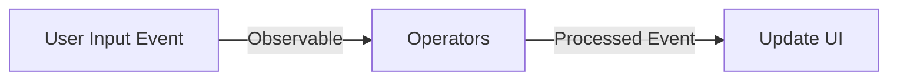

## 9.3.2 Handling User Input Reactively

In the realm of modern web development, creating responsive and efficient user interfaces is paramount. Users expect real-time feedback and seamless interactions, which can be challenging to implement with traditional event-driven models. Reactive programming offers a paradigm shift, enabling developers to handle user input in a more declarative and efficient manner. This section delves into handling user input reactively using Observables, a cornerstone of reactive programming, particularly with libraries like RxJS in JavaScript and TypeScript.

### The Importance of Responsive User Input Handling

User input events such as clicks, keypresses, and mouse movements are fundamental to interactive applications. Efficient handling of these events is crucial for:

- **User Experience**: Immediate feedback to user actions enhances satisfaction and usability.
- **Performance**: Minimizing unnecessary computations and updates reduces CPU usage and improves responsiveness.
- **Maintainability**: A declarative approach to event handling simplifies code and reduces bugs.

Reactive programming, with its focus on data streams and the propagation of change, offers tools to address these challenges effectively.

### Observables: Capturing and Processing Events

Observables are a core concept in reactive programming, representing a stream of data that can be observed and manipulated over time. They provide a powerful abstraction for handling asynchronous events, including user input.

#### Creating Observables from DOM Events

Using the `fromEvent` function, developers can easily create Observables from DOM events. This allows for a clean and declarative way to handle user interactions.

```javascript
import { fromEvent } from 'rxjs';

// Create an Observable from a button click event
const button = document.getElementById('myButton');
const click$ = fromEvent(button, 'click');

click$.subscribe(() => {
  console.log('Button clicked!');
});
```

In this example, `fromEvent` is used to create an Observable that emits a value every time the button is clicked. The `subscribe` method is then used to react to these events.

### Managing Rapid Event Emissions

User input events can often occur in rapid succession, leading to performance issues if not managed properly. Operators like `debounceTime`, `throttleTime`, and `distinctUntilChanged` are invaluable in controlling the flow of events.

#### Debouncing and Throttling Events

- **Debounce**: Delays the processing of an event until a specified time has passed without another event occurring. Useful for scenarios like search input, where you want to wait until the user has stopped typing before processing.

```javascript
import { fromEvent } from 'rxjs';
import { debounceTime } from 'rxjs/operators';

const searchInput = document.getElementById('search');
const search$ = fromEvent(searchInput, 'input').pipe(
  debounceTime(300)
);

search$.subscribe(event => {
  console.log('Search query:', event.target.value);
});
```

- **Throttle**: Limits the number of events processed over time. This is useful for scenarios like scroll events, where you want to reduce the frequency of updates.

```javascript
import { throttleTime } from 'rxjs/operators';

const scroll$ = fromEvent(window, 'scroll').pipe(
  throttleTime(200)
);

scroll$.subscribe(() => {
  console.log('Scroll event');
});
```

#### Avoiding Redundant Processing with `distinctUntilChanged`

The `distinctUntilChanged` operator ensures that only distinct consecutive values are emitted, preventing unnecessary updates.

```javascript
import { distinctUntilChanged, map } from 'rxjs/operators';

const input$ = fromEvent(searchInput, 'input').pipe(
  map(event => event.target.value),
  distinctUntilChanged()
);

input$.subscribe(value => {
  console.log('Distinct search query:', value);
});
```

### Implementing Reactive Features: Type-Ahead Search

Type-ahead search or autocomplete is a common feature that benefits significantly from reactive programming. By combining Observables with operators, we can create a responsive and efficient type-ahead search.

```javascript
import { fromEvent } from 'rxjs';
import { debounceTime, map, distinctUntilChanged, switchMap } from 'rxjs/operators';
import { ajax } from 'rxjs/ajax';

const searchBox = document.getElementById('searchBox');
const search$ = fromEvent(searchBox, 'input').pipe(
  map(event => event.target.value),
  debounceTime(300),
  distinctUntilChanged(),
  switchMap(query => ajax.getJSON(`/api/search?q=${query}`))
);

search$.subscribe(results => {
  console.log('Search results:', results);
});
```

In this example, `switchMap` is used to switch to a new Observable each time a new search query is made, ensuring that only the latest request is processed.

### Best Practices for Managing Event Subscriptions

Managing subscriptions is crucial to prevent memory leaks and ensure optimal performance. Here are some best practices:

- **Unsubscribe**: Always unsubscribe from Observables when they are no longer needed. This can be done manually or using operators like `takeUntil`.

```javascript
import { Subject } from 'rxjs';

const destroy$ = new Subject();

search$.pipe(
  takeUntil(destroy$)
).subscribe(results => {
  console.log('Search results:', results);
});

// Later, when the component is destroyed
destroy$.next();
destroy$.complete();
```

- **Use `AsyncPipe` in Angular**: In Angular, the `AsyncPipe` automatically handles subscriptions and unsubscriptions.

### Handling Complex User Interactions

Complex interactions often involve multiple event streams. Combining these streams can be achieved using operators like `combineLatest`, `merge`, and `withLatestFrom`.

```javascript
import { combineLatest } from 'rxjs';

const mouseMove$ = fromEvent(document, 'mousemove');
const click$ = fromEvent(document, 'click');

combineLatest([mouseMove$, click$]).subscribe(([moveEvent, clickEvent]) => {
  console.log('Mouse moved and clicked:', moveEvent, clickEvent);
});
```

### Integrating Reactive Event Handling with State Management

State management is a critical aspect of modern applications. Integrating reactive event handling with state management solutions like Redux or NgRx can streamline application architecture.

- **Redux Observable**: A middleware for Redux that uses RxJS to handle side effects.
- **NgRx Effects**: An Angular library for managing side effects using Observables.

### Accessibility and Responsive User Experiences

When handling user input reactively, it's important to ensure that applications remain accessible. This includes:

- **Keyboard Navigation**: Ensure that all interactive elements are accessible via keyboard.
- **Screen Readers**: Use appropriate ARIA attributes to provide context to screen readers.
- **Responsive Design**: Ensure that applications adapt to different screen sizes and input methods.

### Error Handling in Reactive Event Processing

Errors in event processing can be handled using operators like `catchError` and `retry`.

```javascript
import { catchError } from 'rxjs/operators';
import { of } from 'rxjs';

search$.pipe(
  catchError(error => {
    console.error('Error occurred:', error);
    return of([]);
  })
).subscribe(results => {
  console.log('Search results:', results);
});
```

### Testing Event-Driven Code

Testing reactive code involves simulating user interactions and verifying the expected outcomes. Tools like Jasmine and Jest, combined with libraries like RxJS Marbles, can facilitate this process.

```javascript
import { TestScheduler } from 'rxjs/testing';

const testScheduler = new TestScheduler((actual, expected) => {
  expect(actual).toEqual(expected);
});

testScheduler.run(({ hot, expectObservable }) => {
  const input$ = hot('-a--b-c-|', { a: 'foo', b: 'bar', c: 'baz' });
  const expected = '-a-----c-|';

  expectObservable(input$.pipe(debounceTime(3))).toBe(expected);
});
```

### Performance Implications and Real-Time Applications

Reactive programming can significantly enhance performance, especially in real-time applications. By efficiently managing event streams and minimizing unnecessary updates, applications can remain responsive under heavy load.

### Advantages of Reactive Programming

- **Declarative Code**: Simplifies complex asynchronous logic.
- **Composability**: Easily combine multiple streams and operators.
- **Scalability**: Handle large volumes of events efficiently.

### Continuous Learning and Experimentation

Reactive programming is a powerful paradigm that requires practice and experimentation. Developers are encouraged to explore libraries like RxJS, experiment with different operators, and integrate reactive patterns into their projects.

### Conclusion

Handling user input reactively transforms how developers approach user interface development. By leveraging Observables and reactive patterns, applications become more responsive, maintainable, and scalable. As you continue to explore reactive programming, consider the best practices discussed here, and apply them to create efficient and engaging user experiences.

### Mermaid Diagram

To illustrate the flow of reactive event processing, consider the following diagram:



This diagram captures the essence of reactive programming: capturing user input as Observables, processing them through operators, and updating the UI based on the processed events.

## Quiz Time!



### What is the primary benefit of using Observables for handling user input?

- [x] They provide a declarative way to handle asynchronous events.
- [ ] They make the code more complex and harder to understand.
- [ ] They eliminate the need for any error handling.
- [ ] They automatically optimize the code for performance.

> **Explanation:** Observables offer a declarative approach to handling asynchronous events, simplifying code and improving maintainability.

### Which operator is used to delay processing of an event until a specified time has passed without another event occurring?

- [ ] throttleTime
- [x] debounceTime
- [ ] distinctUntilChanged
- [ ] switchMap

> **Explanation:** `debounceTime` is used to delay event processing, which is useful for scenarios like search input.

### How can you prevent memory leaks when using Observables?

- [ ] By never unsubscribing from Observables.
- [x] By unsubscribing from Observables when they are no longer needed.
- [ ] By using only synchronous Observables.
- [ ] By avoiding the use of any operators.

> **Explanation:** Unsubscribing from Observables when they are no longer needed prevents memory leaks.

### What is the role of `switchMap` in a type-ahead search implementation?

- [ ] It combines multiple Observables into one.
- [ ] It ensures only distinct values are emitted.
- [x] It switches to a new Observable for each new search query.
- [ ] It throttles the number of emitted events.

> **Explanation:** `switchMap` switches to a new Observable each time a new search query is made, ensuring only the latest request is processed.

### Which of the following is a best practice for integrating reactive event handling with state management?

- [x] Using Redux Observable or NgRx Effects.
- [ ] Avoiding any state management libraries.
- [ ] Handling state changes directly in the UI components.
- [ ] Using only synchronous state updates.

> **Explanation:** Libraries like Redux Observable or NgRx Effects integrate reactive event handling with state management efficiently.

### What is a key consideration for accessibility when handling user input reactively?

- [ ] Only focusing on mouse interactions.
- [ ] Ignoring keyboard navigation.
- [x] Ensuring all interactive elements are accessible via keyboard.
- [ ] Using complex animations for feedback.

> **Explanation:** Ensuring keyboard accessibility is crucial for making applications accessible to all users.

### How can errors in event processing be handled in a reactive context?

- [ ] By ignoring them.
- [x] By using operators like `catchError`.
- [ ] By using synchronous error handling.
- [ ] By avoiding any error-prone operations.

> **Explanation:** Operators like `catchError` are used in reactive programming to handle errors gracefully.

### What is the impact of reactive user input handling on application performance?

- [x] It enhances performance by efficiently managing event streams.
- [ ] It degrades performance due to increased complexity.
- [ ] It has no impact on performance.
- [ ] It only improves performance in non-real-time applications.

> **Explanation:** Reactive user input handling enhances performance by efficiently managing event streams and minimizing unnecessary updates.

### Why is continuous learning important in reactive programming?

- [ ] Because reactive programming is static and unchanging.
- [ ] Because it is only applicable to a few niche applications.
- [x] Because reactive programming is a powerful paradigm that requires practice.
- [ ] Because it eliminates the need for any other programming paradigms.

> **Explanation:** Continuous learning and experimentation are crucial in mastering the powerful paradigm of reactive programming.

### Reactive programming is particularly advantageous for real-time applications.

- [x] True
- [ ] False

> **Explanation:** Reactive programming is advantageous for real-time applications due to its ability to efficiently handle large volumes of events and provide immediate feedback.


