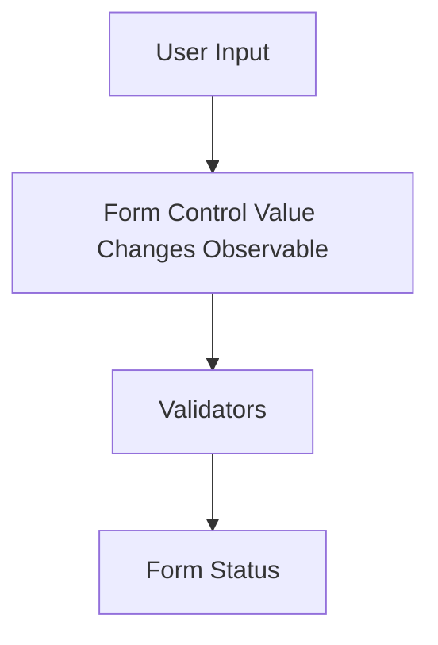

## 9.3.3 Reactive Forms and Validation

In the realm of modern web development, forms are a critical component for user interaction and data collection. Reactive forms, a concept rooted in reactive programming, offer a powerful approach to managing form state and validation. Unlike traditional template-driven forms, reactive forms provide a more structured and dynamic way to handle user input, validation, and form interactions. This article delves into the intricacies of reactive forms, exploring their benefits, implementation strategies, and best practices.

### Understanding Reactive Forms

Reactive forms are a model-driven approach to handling form inputs in web applications. They leverage the power of reactive programming to provide a more flexible and scalable solution for form management. Unlike template-driven forms, which rely heavily on Angular's two-way data binding, reactive forms are built around a more explicit and predictable data flow.

#### Key Differences from Template-Driven Forms

- **Control and Flexibility**: Reactive forms offer greater control over form state and validation logic, allowing developers to define form structure programmatically.
- **Predictable Data Flow**: By using reactive programming principles, reactive forms ensure a clear and predictable data flow, reducing the likelihood of unexpected behavior.
- **Dynamic Validation**: Reactive forms make it easier to implement complex validation logic, including dynamic and asynchronous validators.

### Benefits of Reactive Programming in Form Handling

Reactive programming enhances form handling by providing dynamic validation, real-time feedback, and improved performance. Here are some of the key benefits:

- **Dynamic Validation**: Reactive forms allow for complex validation logic, including conditional and asynchronous validators, which can be easily integrated and maintained.
- **Real-Time Feedback**: By leveraging Observables, reactive forms can provide immediate feedback to users, improving the overall user experience.
- **Performance Optimization**: Reactive forms can be optimized using techniques like debouncing and throttling, ensuring efficient handling of user input.

### Creating Reactive Forms with Angular's ReactiveFormsModule

Angular's ReactiveFormsModule provides a robust framework for building reactive forms. It offers a set of classes and services that facilitate form creation, validation, and data management.

#### Setting Up a Reactive Form

To create a reactive form in Angular, you need to import the ReactiveFormsModule and define your form controls programmatically.

```typescript
import { Component } from '@angular/core';
import { FormGroup, FormControl, Validators } from '@angular/forms';

@Component({
  selector: 'app-reactive-form',
  templateUrl: './reactive-form.component.html',
})
export class ReactiveFormComponent {
  form: FormGroup;

  constructor() {
    this.form = new FormGroup({
      name: new FormControl('', [Validators.required, Validators.minLength(3)]),
      email: new FormControl('', [Validators.required, Validators.email]),
      password: new FormControl('', [Validators.required, Validators.minLength(6)]),
    });
  }

  onSubmit() {
    if (this.form.valid) {
      console.log('Form Submitted!', this.form.value);
    }
  }
}
```

In this example, we define a form group with three form controls: name, email, and password. Each control is initialized with a default value and a set of validators.

### Using Observables to Monitor Form Control Values

Observables are a core part of reactive programming and play a crucial role in reactive forms. They allow you to monitor changes in form control values and validation status in real-time.

#### Subscribing to Form Control Changes

You can subscribe to form control value changes using the `valueChanges` Observable.

```typescript
this.form.get('email').valueChanges.subscribe(value => {
  console.log('Email changed:', value);
});
```

This code snippet logs the email field's value whenever it changes, allowing you to implement custom logic based on user input.

### Implementing Custom Validators

Custom validators are essential for implementing complex validation logic that goes beyond built-in validators. In reactive forms, you can define both synchronous and asynchronous validators.

#### Creating a Custom Synchronous Validator

A custom synchronous validator is a function that returns a validation error object or null.

```typescript
function forbiddenNameValidator(control: FormControl): { [key: string]: any } | null {
  const forbidden = /admin/.test(control.value);
  return forbidden ? { 'forbiddenName': { value: control.value } } : null;
}

this.form = new FormGroup({
  username: new FormControl('', [forbiddenNameValidator]),
});
```

#### Asynchronous Validation Logic

Asynchronous validators are useful for scenarios like server-side validation. They return an Observable that emits a validation error object or null.

```typescript
function uniqueEmailValidator(control: FormControl): Observable<{ [key: string]: any } | null> {
  return of(control.value).pipe(
    delay(1000),
    map(email => email === 'test@example.com' ? { 'emailTaken': true } : null)
  );
}

this.form.get('email').setAsyncValidators(uniqueEmailValidator);
```

### Handling Complex Form Interactions

Reactive forms excel at handling complex form interactions, such as dependent fields and conditional validations.

#### Dependent Fields and Conditional Validation

You can implement dependent fields by subscribing to changes in one field and updating the validation logic of another.

```typescript
this.form.get('password').valueChanges.subscribe(password => {
  const confirmPasswordControl = this.form.get('confirmPassword');
  if (password) {
    confirmPasswordControl.setValidators([Validators.required, this.matchPasswordValidator(password)]);
  } else {
    confirmPasswordControl.clearValidators();
  }
  confirmPasswordControl.updateValueAndValidity();
});
```

### Data Flow and Validation in Reactive Forms

Understanding the flow of data and validation in reactive forms is crucial for designing efficient forms. The following Mermaid.js diagram illustrates this process:



### Best Practices for Organizing Form Code

To maintain clean and maintainable code, it's essential to organize your form logic effectively.

- **Separation of Concerns**: Keep form logic separate from UI logic by encapsulating it in services or separate components.
- **Reusable Components**: Create reusable form components and validators to reduce code duplication and improve maintainability.
- **Consistent Naming**: Use consistent naming conventions for form controls and validation logic to enhance readability.

### Optimizing Performance with Debouncing and Throttling

To optimize performance, especially in large forms, consider debouncing or throttling user input.

```typescript
this.form.get('search').valueChanges.pipe(
  debounceTime(300),
  distinctUntilChanged()
).subscribe(value => this.search(value));
```

### Integrating Reactive Forms with Back-End Services

Reactive forms can be easily integrated with back-end services for data submission and retrieval.

```typescript
onSubmit() {
  if (this.form.valid) {
    this.http.post('/api/submit', this.form.value).subscribe(response => {
      console.log('Form submitted successfully', response);
    });
  }
}
```

### Error Handling and Displaying Validation Messages

Proper error handling and user feedback are crucial for a good user experience.

```html
<div *ngIf="form.get('email').hasError('emailTaken')">
  Email is already taken.
</div>
```

### Creating Reusable Form Components and Validators

Reusable components and validators streamline form development and enhance consistency.

```typescript
import { AbstractControl, ValidatorFn } from '@angular/forms';

export function forbiddenNameValidator(nameRe: RegExp): ValidatorFn {
  return (control: AbstractControl): { [key: string]: any } | null => {
    const forbidden = nameRe.test(control.value);
    return forbidden ? { 'forbiddenName': { value: control.value } } : null;
  };
}
```

### Form Initialization and Resetting Values

Reactive forms provide methods for initializing and resetting form values programmatically.

```typescript
this.form.reset({
  name: 'John Doe',
  email: 'john.doe@example.com'
});
```

### Dynamic Form Creation Based on Data Models

Reactive forms can be dynamically created based on data models, allowing for flexible form generation.

```typescript
createForm(fields: any[]) {
  const group = {};
  fields.forEach(field => {
    group[field.name] = new FormControl(field.value || '', field.validators || []);
  });
  this.form = new FormGroup(group);
}
```

### Testing Strategies for Reactive Forms

Testing reactive forms is crucial for ensuring reliability and correctness.

- **Unit Testing**: Test individual form controls and validation logic using Angular's testing utilities.
- **Integration Testing**: Test form interactions and data flow to ensure seamless integration with other components.

### Enhancing User Experience and Data Integrity

Reactive forms play a vital role in enhancing user experience and ensuring data integrity. By providing real-time feedback and robust validation, they help create user-friendly interfaces that are both efficient and reliable.

### Conclusion

Reactive forms offer a powerful approach to form handling in modern web applications. By leveraging reactive programming principles, they provide dynamic validation, real-time feedback, and improved performance. By following best practices and implementing the strategies discussed in this article, you can create efficient, maintainable, and user-friendly forms that enhance the overall user experience.

## Quiz Time!



### What is a key advantage of reactive forms over template-driven forms?

- [x] Greater control and flexibility
- [ ] Simpler syntax
- [ ] Less code required
- [ ] Automatic validation

> **Explanation:** Reactive forms offer greater control and flexibility by allowing developers to define form structure and validation logic programmatically.

### How can you monitor changes in a form control's value in reactive forms?

- [x] Using the `valueChanges` Observable
- [ ] Using the `ngModel` directive
- [ ] Using the `ngChange` event
- [ ] Using the `onChange` method

> **Explanation:** The `valueChanges` Observable allows you to monitor changes in a form control's value in real-time.

### Which Angular module provides support for reactive forms?

- [x] ReactiveFormsModule
- [ ] FormsModule
- [ ] HttpClientModule
- [ ] CommonModule

> **Explanation:** The ReactiveFormsModule provides the necessary classes and services for building reactive forms in Angular.

### What is the purpose of a custom validator in reactive forms?

- [x] To implement complex validation logic
- [ ] To simplify form syntax
- [ ] To automatically generate form controls
- [ ] To handle form submissions

> **Explanation:** Custom validators allow developers to implement complex validation logic that goes beyond built-in validators.

### How can you optimize performance when handling user input in large forms?

- [x] Debouncing or throttling input
- [ ] Using synchronous validators only
- [ ] Disabling validation
- [ ] Submitting form data immediately

> **Explanation:** Debouncing or throttling input helps optimize performance by reducing the frequency of processing user input.

### What is a common use case for asynchronous validators in reactive forms?

- [x] Server-side validation
- [ ] Client-side validation
- [ ] Form initialization
- [ ] Form submission

> **Explanation:** Asynchronous validators are commonly used for server-side validation, where validation logic depends on external data.

### How can you handle complex form interactions, such as dependent fields, in reactive forms?

- [x] Subscribing to changes in one field and updating another
- [ ] Using template-driven forms
- [ ] Disabling dependent fields
- [ ] Using static validation rules

> **Explanation:** By subscribing to changes in one field, you can dynamically update the validation logic of another field.

### What is a best practice for organizing form code in reactive forms?

- [x] Separation of concerns
- [ ] Embedding all logic in the template
- [ ] Using global variables
- [ ] Avoiding reusable components

> **Explanation:** Separation of concerns helps maintain clean and maintainable code by keeping form logic separate from UI logic.

### How can you provide real-time feedback to users in reactive forms?

- [x] Using Observables to monitor form control values
- [ ] Using static validation messages
- [ ] Disabling real-time feedback
- [ ] Using template-driven forms

> **Explanation:** Observables allow you to monitor form control values in real-time, providing immediate feedback to users.

### True or False: Reactive forms can be dynamically created based on data models.

- [x] True
- [ ] False

> **Explanation:** Reactive forms can be dynamically created based on data models, allowing for flexible form generation.


