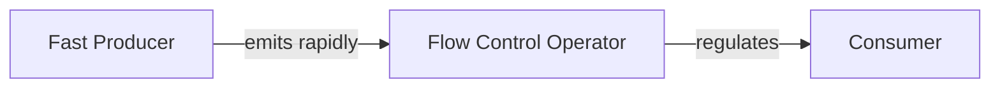

## 9.4.2 Backpressure and Flow Control

In the realm of reactive programming, backpressure and flow control are pivotal concepts that ensure the stability and efficiency of data processing pipelines. As systems become more reactive and data-driven, understanding and managing backpressure becomes increasingly critical. This section delves into the challenges posed by backpressure, explores various flow control strategies, and provides practical guidance on implementing these strategies in JavaScript and TypeScript.

### Understanding Backpressure

Backpressure occurs when data is produced at a rate faster than it can be consumed. This imbalance can lead to several issues, including memory leaks, performance degradation, and even system crashes. In reactive systems, where data flows continuously between producers and consumers, managing this flow is crucial to maintaining system health and performance.

#### Challenges of Backpressure in Reactive Systems

- **Memory Leaks**: When data accumulates faster than it can be processed, it can lead to increased memory usage, eventually causing memory leaks if the system cannot handle the backlog.
- **Performance Degradation**: Excessive data can overwhelm the consumer, leading to slower processing speeds and reduced system responsiveness.
- **System Crashes**: In severe cases, unhandled backpressure can cause the system to crash due to resource exhaustion.

### Flow Control Strategies

To manage backpressure effectively, various flow control strategies can be employed. These strategies help regulate the rate of data emission and ensure that consumers are not overwhelmed by the data flow.

#### Key Flow Control Operators

1. **Throttle**: Limits the rate at which data is emitted. It ensures that data is only emitted at specified intervals, reducing the load on the consumer.

   ```javascript
   import { interval } from 'rxjs';
   import { throttleTime } from 'rxjs/operators';

   const source = interval(100);
   const throttled = source.pipe(throttleTime(1000));

   throttled.subscribe(value => console.log(`Throttled Value: ${value}`));
   ```

2. **Debounce**: Emits data only after a specified duration has passed without any new data being produced. Useful for handling bursty data.

   ```javascript
   import { fromEvent } from 'rxjs';
   import { debounceTime } from 'rxjs/operators';

   const clicks = fromEvent(document, 'click');
   const debounced = clicks.pipe(debounceTime(300));

   debounced.subscribe(() => console.log('Debounced Click'));
   ```

3. **Sample**: Emits the most recent data value at specified intervals, regardless of how much data has been produced.

   ```javascript
   import { interval } from 'rxjs';
   import { sampleTime } from 'rxjs/operators';

   const source = interval(100);
   const sampled = source.pipe(sampleTime(1000));

   sampled.subscribe(value => console.log(`Sampled Value: ${value}`));
   ```

4. **Buffer**: Collects data into an array and emits it as a batch, either after a specified interval or when a certain condition is met.

   ```javascript
   import { interval } from 'rxjs';
   import { bufferTime } from 'rxjs/operators';

   const source = interval(100);
   const buffered = source.pipe(bufferTime(1000));

   buffered.subscribe(values => console.log(`Buffered Values: ${values}`));
   ```

### Using Window and Buffer Operators

The `window` and `buffer` operators provide powerful mechanisms for batching data emissions, which can be particularly useful in managing backpressure.

- **Window Operator**: Similar to `buffer`, but emits a new observable for each batch of data, allowing for more complex processing.

  ```javascript
  import { interval } from 'rxjs';
  import { windowTime, mergeAll, toArray } from 'rxjs/operators';

  const source = interval(100);
  const windowed = source.pipe(windowTime(1000), mergeAll(), toArray());

  windowed.subscribe(values => console.log(`Windowed Values: ${values}`));
  ```

- **Buffer Operator**: Collects data into an array and emits it as a batch. This can help reduce the frequency of emissions and manage the load on consumers.

  ```javascript
  import { interval } from 'rxjs';
  import { bufferCount } from 'rxjs/operators';

  const source = interval(100);
  const buffered = source.pipe(bufferCount(10));

  buffered.subscribe(values => console.log(`Buffered Values: ${values}`));
  ```

### Selecting the Appropriate Strategy

Choosing the right flow control strategy depends on the specific requirements of your application. Consider the following factors:

- **Data Sensitivity**: If data loss is unacceptable, use strategies like `buffer` or `window` to ensure all data is captured.
- **Latency Requirements**: For real-time applications, `throttle` or `debounce` can help maintain responsiveness.
- **System Resources**: Consider the memory and processing capacity of your system when selecting a strategy.

### Impact on User Experience and System Responsiveness

Flow control directly impacts user experience and system responsiveness. Properly implemented flow control can enhance responsiveness by preventing system overloads and ensuring smooth data processing. However, aggressive throttling or buffering can introduce latency, which may not be suitable for real-time applications.

### Considerations for Real-Time Applications

In real-time applications, where timely data processing is critical, flow control must be carefully balanced to avoid data loss. Techniques like `sample` and `throttle` can help manage data flow without overwhelming the system, but they may result in some data being dropped.

### Best Practices for Monitoring and Adjusting Flow Control

- **Dynamic Adjustment**: Implement mechanisms to adjust flow control parameters dynamically based on system load and performance metrics.
- **Monitoring Tools**: Use monitoring tools to track data flow and identify potential bottlenecks or backpressure issues.
- **Load Testing**: Conduct load testing to simulate high data volumes and evaluate the effectiveness of your flow control strategies.

### The Role of Buffering

Buffering is a common technique for managing backpressure, but it comes with trade-offs. While buffering can help smooth out data flow and prevent system overloads, it can also introduce latency and increase memory usage.

### Leveraging Schedulers and Concurrency Controls

Schedulers and concurrency controls can further enhance flow control by managing the execution context and concurrency level of data processing.

- **Schedulers**: Use schedulers to control when and where data processing occurs, optimizing resource usage and performance.
- **Concurrency Controls**: Limit the number of concurrent operations to prevent resource exhaustion and ensure stable system performance.

### Understanding Data Production and Consumption Patterns

A deep understanding of your application's data production and consumption patterns is essential for effective backpressure management. Analyze these patterns to identify potential bottlenecks and tailor your flow control strategies accordingly.

### Conclusion

Managing backpressure and flow control is a critical aspect of building robust and responsive reactive systems. By understanding the challenges posed by backpressure and implementing appropriate flow control strategies, you can ensure the stability and efficiency of your data processing pipelines. Whether you're building real-time applications or handling large volumes of data, the techniques and best practices discussed in this section will equip you with the tools needed to manage data flow effectively.

### Mermaid Diagram

To visualize the concept of backpressure handling, consider the following diagram:



This diagram illustrates how a flow control operator acts as a mediator between a fast producer and a consumer, ensuring that data is processed at a manageable rate.

### Further Reading and Resources

- [RxJS Documentation](https://rxjs.dev/guide/operators)
- [ReactiveX: An API for Asynchronous Programming with Observable Streams](http://reactivex.io/)
- [JavaScript: The Good Parts by Douglas Crockford](https://www.oreilly.com/library/view/javascript-the-good/9780596517748/)
- [TypeScript Deep Dive by Basarat Ali Syed](https://basarat.gitbook.io/typescript/)

By proactively designing systems with backpressure in mind and leveraging the strategies outlined in this section, you can build more resilient and performant applications.

---

## Quiz Time!



### What is backpressure in reactive systems?

- [x] A situation where data is produced faster than it can be consumed
- [ ] A method for increasing data production speed
- [ ] A technique for reducing data latency
- [ ] A strategy for optimizing memory usage

> **Explanation:** Backpressure refers to the condition where the rate of data production exceeds the rate of data consumption, leading to potential system overloads.

### What is one of the main challenges posed by backpressure?

- [x] Memory leaks
- [ ] Increased data accuracy
- [ ] Faster data processing
- [ ] Enhanced user experience

> **Explanation:** Backpressure can lead to memory leaks as data accumulates faster than it can be processed, consuming system resources.

### Which operator would you use to limit the rate of data emission to specified intervals?

- [x] Throttle
- [ ] Debounce
- [ ] Buffer
- [ ] Sample

> **Explanation:** The `throttle` operator limits the rate at which data is emitted, ensuring that emissions occur at specified intervals.

### Which operator emits data only after a specified duration has passed without new data?

- [ ] Throttle
- [x] Debounce
- [ ] Buffer
- [ ] Sample

> **Explanation:** The `debounce` operator emits data only after a specified duration has passed without any new data being produced.

### What is a key consideration when choosing a flow control strategy?

- [x] Data sensitivity
- [ ] Code complexity
- [ ] Operator availability
- [ ] Language syntax

> **Explanation:** Data sensitivity is crucial when selecting a flow control strategy, as it determines how much data loss can be tolerated.

### What is a potential trade-off of using buffering for flow control?

- [x] Increased latency
- [ ] Reduced data accuracy
- [ ] Enhanced real-time performance
- [ ] Lower memory usage

> **Explanation:** Buffering can introduce latency as data is collected into batches before being processed, which may not be suitable for real-time applications.

### How can you dynamically adjust flow control mechanisms?

- [x] Based on system load and performance metrics
- [ ] By hardcoding values
- [ ] By increasing data production speed
- [ ] By reducing data consumption rate

> **Explanation:** Dynamic adjustment of flow control mechanisms based on system load and performance metrics helps maintain optimal performance.

### What is the role of schedulers in flow control?

- [x] To control when and where data processing occurs
- [ ] To increase data production speed
- [ ] To reduce memory usage
- [ ] To enhance data accuracy

> **Explanation:** Schedulers help manage the execution context and timing of data processing, optimizing resource usage and performance.

### What is the impact of aggressive throttling on real-time applications?

- [x] It may result in data loss
- [ ] It improves data accuracy
- [ ] It enhances system responsiveness
- [ ] It increases memory usage

> **Explanation:** Aggressive throttling can lead to data loss in real-time applications, where timely data processing is critical.

### True or False: Understanding data production and consumption patterns is essential for effective backpressure management.

- [x] True
- [ ] False

> **Explanation:** Understanding these patterns is crucial for identifying potential bottlenecks and tailoring flow control strategies effectively.


