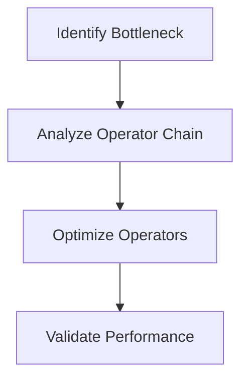

---

linkTitle: "9.4.4 Performance Optimization and Debugging"
title: "Performance Optimization and Debugging in Reactive Programming"
description: "Explore advanced performance optimization and debugging techniques in reactive programming with JavaScript and TypeScript, focusing on RxJS and Observables."
categories:
- Reactive Programming
- Performance Optimization
- Debugging
tags:
- JavaScript
- TypeScript
- RxJS
- Observables
- Performance
- Debugging
date: 2024-10-25
type: docs
nav_weight: 944000
---

## 9.4.4 Performance Optimization and Debugging in Reactive Programming

In the realm of modern web applications, reactive programming has become a cornerstone for managing asynchronous data streams efficiently. However, with the power of reactive programming comes the responsibility of ensuring that our applications remain performant and debuggable. This section delves into advanced performance optimization and debugging techniques for reactive programming, particularly focusing on JavaScript and TypeScript applications using RxJS.

### The Importance of Performance in Reactive Applications

Reactive applications often handle a multitude of data streams, which can lead to performance bottlenecks if not managed properly. Inefficient code can result in slow user interfaces, increased resource consumption, and ultimately, a poor user experience. Therefore, understanding and optimizing the performance of reactive code is crucial for building responsive and efficient applications.

### Profiling Reactive Code

Profiling is the first step in performance optimization. It involves identifying bottlenecks and resource-intensive operations within your reactive code. Tools like Chrome DevTools, Firefox Developer Edition, and Node.js profiling tools can be instrumental in this process.

#### Identifying Bottlenecks

To identify bottlenecks, you need to monitor the execution time of various parts of your code. This can be achieved by:

- **Using Performance Profiles:** Capture performance profiles to visualize the call stack and identify slow operations.
- **Analyzing Network Activity:** Monitor network requests to ensure that data fetching is not a bottleneck.
- **Observing Memory Usage:** Keep an eye on memory usage to detect leaks or excessive consumption.

#### Analyzing Operator Chains

In reactive programming, operator chains can become complex and resource-intensive. Profiling these chains helps in understanding where optimizations can be made.



### Tools and Techniques for Debugging Observables

Debugging reactive code can be challenging due to its asynchronous nature. However, several tools and techniques can aid in this process:

#### Using the `tap` Operator

The `tap` operator in RxJS allows you to perform side effects, such as logging, without affecting the observable stream. This can be invaluable for debugging:

```typescript
import { of } from 'rxjs';
import { tap, map } from 'rxjs/operators';

of(1, 2, 3)
  .pipe(
    tap(value => console.log('Before map:', value)),
    map(value => value * 2),
    tap(value => console.log('After map:', value))
  )
  .subscribe();
```

#### Debugging Libraries

Libraries like `rxjs-spy` provide powerful tools for inspecting and debugging RxJS streams. These tools can help visualize the flow of data through observables and identify issues.

### Common Performance Issues

Reactive applications can suffer from several performance issues, including:

- **Unnecessary Subscriptions:** Multiple subscriptions to the same data stream can lead to redundant computations.
- **Heavy Computations in Operators:** Performing resource-intensive computations within operators can block the event loop.
- **Memory Leaks:** Failing to unsubscribe from observables can cause memory leaks.

### Optimizing Operator Chains

To optimize operator chains, consider the following strategies:

- **Reduce the Number of Operators:** Combine operations where possible to minimize the overhead of multiple operators.
- **Use Efficient Operators:** Choose operators that are optimized for performance, such as `mergeMap` over `switchMap` when appropriate.
- **Debounce Expensive Operations:** Use operators like `debounceTime` to limit the frequency of expensive operations.

### Subscription Management

Proper subscription management is essential to prevent memory leaks and ensure efficient resource usage. Use operators like `takeUntil` and `unsubscribe` to manage subscriptions effectively.

```typescript
import { interval, Subject } from 'rxjs';
import { takeUntil } from 'rxjs/operators';

const stop$ = new Subject<void>();

interval(1000)
  .pipe(takeUntil(stop$))
  .subscribe(value => console.log(value));

// Stop the subscription after 5 seconds
setTimeout(() => stop$.next(), 5000);
```

### Minimizing the Impact of Expensive Operations

Expensive operations can be mitigated through techniques such as:

- **Caching Results:** Store results of expensive operations to avoid recomputation.
- **Using Schedulers:** Offload work to appropriate execution contexts using RxJS Schedulers.

### Using Schedulers

Schedulers in RxJS control the execution context of observables. They can be used to offload work from the main thread, improving performance.

```typescript
import { asyncScheduler, of } from 'rxjs';
import { observeOn } from 'rxjs/operators';

of(1, 2, 3)
  .pipe(observeOn(asyncScheduler))
  .subscribe(value => console.log(value));
```

### Challenges of Debugging Asynchronous and Concurrent Code

Debugging asynchronous and concurrent code requires a systematic approach:

- **Isolate Components:** Test components in isolation to pinpoint issues.
- **Controlled Environments:** Use controlled environments to replicate and debug issues.
- **Logging and Error Handling:** Implement comprehensive logging and custom error handling to gain insights.

### Systematic Approaches to Debugging

Adopt systematic approaches to debugging:

- **Divide and Conquer:** Break down complex operator chains into simpler parts for easier debugging.
- **Test-Driven Debugging:** Write tests to reproduce and fix bugs systematically.

### Code Refactoring and Best Practices

Refactoring code can lead to significant performance improvements. Consider the following best practices:

- **Simplify Logic:** Simplify complex logic to improve readability and performance.
- **Avoid Side Effects:** Minimize side effects within operators to maintain purity and predictability.

### The Role of Code Reviews and Collaboration

Code reviews and collaboration are vital for maintaining high-performance code. They provide opportunities for peer feedback and knowledge sharing.

### Staying Informed and Continuous Learning

Stay informed about updates and performance enhancements in RxJS and related libraries. Engage with the community through forums, blogs, and conferences to keep abreast of best practices.

### Balancing Optimization and Code Readability

While optimization is essential, it should not come at the expense of code readability and maintainability. Strive for a balance that ensures both performance and clarity.

### Resources for Further Learning

- **Official RxJS Documentation:** [RxJS Docs](https://rxjs.dev/)
- **RxJS GitHub Repository:** [RxJS GitHub](https://github.com/ReactiveX/rxjs)
- **Books and Courses:** Explore books like "Learning RxJS" and online courses on platforms like Udemy and Coursera.
- **Community Forums:** Engage with the RxJS community on platforms like Stack Overflow and Reddit.

### Conclusion

Performance optimization and debugging are critical aspects of building efficient reactive applications. By understanding the intricacies of reactive programming and employing the techniques discussed, you can ensure your applications are both performant and maintainable. Remember, the goal is to create applications that provide a seamless user experience while maintaining the flexibility and power of reactive programming.

## Quiz Time!



### What is the primary purpose of profiling reactive code?

- [x] To identify bottlenecks and resource-intensive operations
- [ ] To enhance code readability
- [ ] To increase the number of operators
- [ ] To simplify logic

> **Explanation:** Profiling helps identify performance bottlenecks and resource-intensive operations, allowing developers to optimize their code effectively.

### Which RxJS operator is useful for logging data without affecting the stream?

- [x] `tap`
- [ ] `map`
- [ ] `filter`
- [ ] `mergeMap`

> **Explanation:** The `tap` operator is used for performing side effects, such as logging, without altering the observable stream.

### What is a common cause of memory leaks in reactive applications?

- [x] Unmanaged subscriptions
- [ ] Using too many operators
- [ ] Heavy computations in operators
- [ ] Lack of caching

> **Explanation:** Unmanaged subscriptions can lead to memory leaks if observables are not properly unsubscribed.

### Which strategy can help minimize the impact of expensive operations in reactive code?

- [x] Caching results
- [ ] Increasing the number of subscriptions
- [ ] Using more operators
- [ ] Reducing logging

> **Explanation:** Caching results of expensive operations prevents unnecessary recomputation, thus improving performance.

### What is the role of Schedulers in RxJS?

- [x] To control the execution context of observables
- [ ] To increase the speed of observables
- [ ] To reduce the number of operators
- [ ] To simplify the logic of observables

> **Explanation:** Schedulers in RxJS are used to control the execution context, allowing work to be offloaded from the main thread.

### Which approach is recommended for debugging asynchronous and concurrent code?

- [x] Systematic approaches
- [ ] Random testing
- [ ] Increasing logging
- [ ] Reducing operators

> **Explanation:** Systematic approaches, such as isolating components and testing in controlled environments, are effective for debugging asynchronous and concurrent code.

### Why is it important to balance optimization and code readability?

- [x] To ensure both performance and maintainability
- [ ] To increase the number of operators
- [ ] To simplify logic
- [ ] To enhance debugging

> **Explanation:** Balancing optimization and code readability ensures that the code remains performant while being easy to understand and maintain.

### What is the benefit of using the `takeUntil` operator?

- [x] It helps manage subscriptions effectively
- [ ] It increases the speed of observables
- [ ] It reduces the number of operators
- [ ] It simplifies logic

> **Explanation:** The `takeUntil` operator is useful for managing subscriptions by automatically unsubscribing when a certain condition is met.

### How can code reviews contribute to performance optimization?

- [x] By providing peer feedback and knowledge sharing
- [ ] By increasing the number of operators
- [ ] By simplifying logic
- [ ] By reducing logging

> **Explanation:** Code reviews facilitate peer feedback and knowledge sharing, which can lead to improved code performance and quality.

### True or False: Debouncing is a technique used to limit the frequency of expensive operations.

- [x] True
- [ ] False

> **Explanation:** Debouncing is indeed a technique used to limit the frequency of expensive operations by delaying their execution until a certain period of inactivity has passed.


